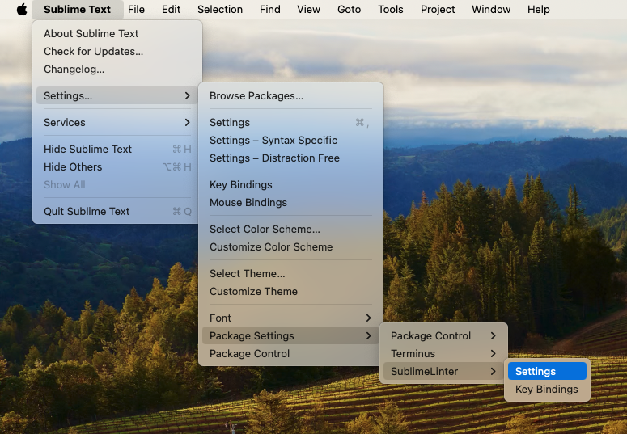
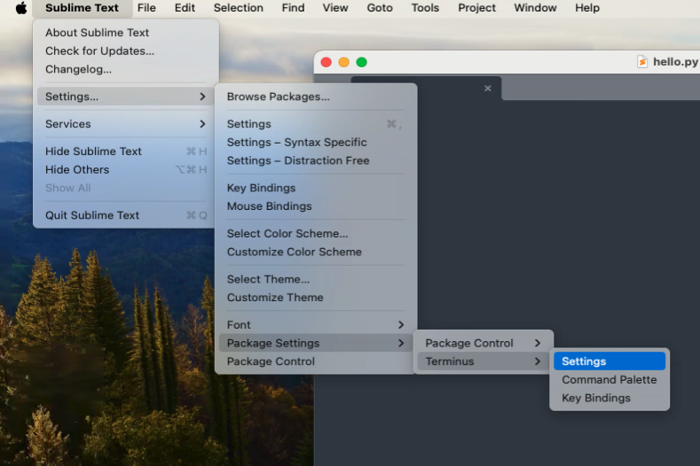
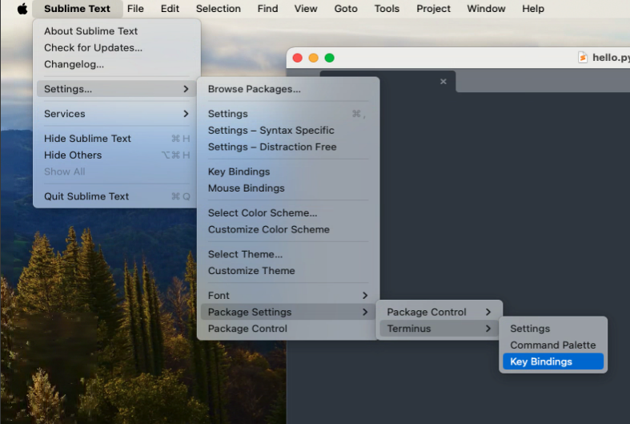

# macOS Setup Guide

Complete setup for macOS users.

> **Note:** If you cannot install local tools, use the **[GitHub Codespaces (CS111 Fundamentals of Programming Template)](https://github.com/codespaces/new?hide_repo_select=true&repo=kittipitch/26cs111codespaces)**.

## Table of Contents

- [Resources](#resources)
- [Python 3.12](#python-312)
- [Sublime Text](#sublime-text)
- [mypy & Terminus](#mypy--terminus)
- [Haskell](#haskell)
- [Other Languages](#other-languages)

---

## Resources

- **CS Wiki**: cs-wiki101
- **Homebrew**: <https://brew.sh>
- **GitHub**: [instructions](https://docs.github.com)

---

## Python 3.12

### Installing Python 3.12

> **Why this matters:** macOS includes its own Python 3 (which changes with OS updates), and Homebrew may install newer versions (3.13, 3.14, etc.). CS courses require **Python 3.12** specifically. These steps ensure `python3` always points to 3.12.

#### Option 1: Using Homebrew (recommended)

```bash
brew install python@3.12
```

Add Python 3.12 to the **front** of your PATH. This ensures `python3` and `pip3` point to the 3.12 version:

```bash
# For Apple Silicon (M1/M2/M3):
echo 'export PATH="/opt/homebrew/opt/python@3.12/libexec/bin:$PATH"' >> ~/.zshrc

# OR for Intel Macs:
# echo 'export PATH="/usr/local/opt/python@3.12/libexec/bin:$PATH"' >> ~/.zshrc

source ~/.zshrc
```

**Immediately verify:**

```bash
python3 --version   # MUST show Python 3.12.x
which python3       # Should show .../python@3.12/libexec/bin/python3
pip3 --version      # Should reference 3.12
```

> **Note:** Using `libexec/bin` is necessary because Homebrew's `python@3.12` is a "keg-only" formula. The `libexec` directory contains the generic `python3` and `pip3` symlinks that point specifically to version 3.12.

> **If `python3 --version` shows 3.13 or another version:** The PATH order is wrong. Check `echo $PATH` — `python@3.12/libexec/bin` must appear **before** other Python paths. You may need to edit `~/.zshrc` and move the Python 3.12 export line to the **top** of the file.

#### Option 2: Official installer

Download the macOS installer from <https://www.python.org/downloads/> and choose the latest **3.12** release.

After installing, add aliases to your shell (more reliable than symlinks):

```bash
echo 'alias python3=/usr/local/bin/python3.12' >> ~/.zshrc
echo 'alias pip3=/usr/local/bin/pip3.12' >> ~/.zshrc
source ~/.zshrc
```

**Verify:**

```bash
python3 --version   # MUST show Python 3.12.x
which python3       # Should show /usr/local/bin/python3.12
```

---

## Sublime Text

### Install Sublime Text

Download: <https://www.sublimetext.com/download>

### Configure Sublime Text for Python

Make Sublime Text use 4 spaces for Python:

1. Create a `hello.py` file
2. Add content:

   ```python
   #!/usr/bin/env python3
   print("Hello world!!")
   ```

3. Save, then go to **Settings... → Settings - Syntax Specific**
4. Add:

   ```json
   {
      "tab_size": 4,
      "translate_tabs_to_spaces": true,
   }
   ```

5. Save (⌘ + S)

---

## mypy & Terminus

### Installing and Configuring mypy on Sublime Text

This step ensures you have static type checking for Python.

#### 1. Install mypy

```bash
# Using Homebrew
brew install mypy
```

#### 2. Install SublimeLinter and SublimeLinter-mypy

1. **⌘ + Shift + P** → "Package Control: Install Package"


2. Type "SublimeLinter" and hit Enter.


3. **⌘ + Shift + P** → "Package Control: Install Package"
4. Type "SublimeLinter-mypy" and hit Enter.


#### 3. Configure SublimeLinter

Go to **Settings... → Package Settings → SublimeLinter → Settings** and add to the right panel:



```json
{
  "linters": {
    "mypy": {
      "disable": false,
      "executable": ["mypy"],
      "args": ["--ignore-missing-imports"],
      "python": "3.12"
    }
  }
}
```

#### 4. Verify it works

To verify that `mypy` is correctly configured:

1. Create a `test_mypy.py` file in Sublime Text:

   ```python
   #!/usr/bin/env python3

   def hello() -> str:
       return 10
   ```

2. **Save the file.** You should immediately see a red dot or error underline.
3. Hover over the error to see the `mypy` message: **"Incompatible return value type (got 'int', expected 'str')"**, as shown below.

   

4. Change `return 10` to `return "hello"` and save — the error should disappear.

### Installing Terminus on Sublime Text

Terminus provides an integrated terminal within Sublime Text.

#### 1. Install Package Control

- **⌘ + Shift + P**
- Type "Install Package Control" and hit Enter

#### 2. Add Package Control Channel (if needed)

- **⌘ + Shift + P**
- Type "Package Control: Add Channel" and hit Enter
- Paste: `https://packages.sublimetext.io/channel.json`
- Hit Enter

#### 3. Install Terminus

- **⌘ + Shift + P**
- Type "Package Control: Install Package" and hit Enter
- Type "Terminus" and hit Enter


#### 4. Configure Terminus

- Go to **Settings... → Package Settings → Terminus → Settings**




- Edit the right panel and add:

```json
{
    "default_config": {
        "linux": "Bash",
        "osx": "Zsh",
        "windows": "Command Prompt"
    }
}
```

#### 5. Set keyboard shortcuts

- Go to **Settings... → Key Bindings**




- Edit the right panel and add:

```json
[
  {
    "keys": ["alt+`"],
    "command": "toggle_terminus_panel",
    "args": {
      "config_name": null,
      "cwd": "${file_path:${folder}}"
    }
  }
]
```

#### 6. Restart Sublime Text

Now you can use **Alt + `** to open a zsh terminal in Sublime Text.


---

## Haskell

### Haskell Setup via GHCup

We will install GHCup, which manages Haskell compilers and tools.

1. Open your terminal and run:

   ```bash
   curl --proto '=https' --tlsv1.2 -sSf https://get-ghcup.haskell.org | sh
   ```

2. During the installation, answer `y` (Yes) to most prompts, except:
   - **Base channel**: select `g` (GHCup maintained)
   - **Pre-releases / Cross channel**: answer `n` (No)
   - **PATH**: select `a` (Append) or `p` (Prepend)

3. Once completed, load the new PATH:

   ```bash
   source ~/.zshrc
   ```

4. Verify the installation:

   ```bash
   ghcup --version
   ghc --version
   ```

5. Install `stack` and `HUnit`:

   ```bash
   ghcup install stack latest
   cabal update
   cabal install --lib HUnit
   ```

### Configure Sublime Text for Haskell

This setup is **mandatory** for CS115 to ensure proper code formatting and error checking.

1. **Install Ormolu** (Haskell code formatter) globally using stack:

   ```bash
   stack install ormolu-0.7.2.0 --resolver lts-22.44
   ```

2. Make Sublime Text use 2 spaces for Haskell indentation:
   - Save a blank file as `test.hs` to trigger the Haskell syntax, then go to **Settings... → Settings - Syntax Specific**.
   - Add the following configuration:

   ```json
   {
      "tab_size": 2,
      "translate_tabs_to_spaces": true
   }
   ```

3. Connect to the Haskell LSP (Language Server Protocol):
   - Press **⌘ + Shift + P**
   - Select **Package Control: Install Package**
   - Search for and install **LSP**

4. Configure the LSP settings for Haskell:
   - Open command palette again and search for **LSP: Settings**
   - Add the following configuration:

   ```json
   // Settings in here override those in "LSP/LSP.sublime-settings"

   {
     "lsp_format_on_save": true,

     "clients": {
       "haskell-language-server": {
         "enabled": true,
         "command": [
           "bash",
           "-c",
           "source ~/.ghcup/env && haskell-language-server-wrapper --lsp"
         ],
         "selector": "source.haskell",
         "settings": {
           "haskell.formattingProvider": "ormolu"
         }
       }
     }
   }
   ```

   > **Note:** We use `bash -c "source ~/.ghcup/env && ..."` so that bash expands `~` and sets up the ghcup PATH correctly. Using `"env": {"PATH": "$HOME/..."}` does **not** work because JSON does not expand shell variables.

### Create and Run a Haskell File (Hello World)

1. Create a `Hello.hs` file in Sublime Text:

   ```haskell
   main :: IO ()
   main = putStrLn "Hello Haskell!!"
   ```

2. Run the file:

   ```bash
   runghc Hello.hs
   ```

### Verify Ormolu and LSP

Once you have verified the basic setup, create a `TestSetup.hs` to see the LSP in action.

1. Create a `TestSetup.hs` file in Sublime Text:

   ```haskell
   -- 1. Test LSP formatting (Ormolu):
   --    Try to mess up indentation or remove spaces around '=',
   --    then save the file. It should auto-format on save.
   x = 1 + 2

   -- Intentional type error to test LSP - uncomment
   -- badValue :: Int
   -- badValue = "this is not an int"

   main :: IO ()
   main = putStrLn "LSP is working!"
   ```

2. **Save the file** and check if it auto-formats.
3. **Uncomment** the `badValue` lines and save. You should see a red error underline or dot. Hover over it to see the error message (as shown below).

   

4. Comment it back and save the file — the error should disappear.
5. Run the file:

   ```bash
   runghc TestSetup.hs
   ```

---

## Other Languages

For Java, C/C++, NodeJS, and Go setup, refer to the **[Ubuntu guide](UBUNTU.md)**. The commands are generally the same for macOS, with these notes:

### Java

```bash
# Using Homebrew
brew install openjdk@21
```

### C/C++

```bash
# Using Homebrew
brew install gcc
```

For using g++-1x as the default compiler on macOS:

```bash
brew upgrade
sudo rm /usr/local/bin/gcc
sudo rm /usr/local/bin/g++
sudo ln -s /opt/homebrew/bin/gcc-1* /usr/local/bin/gcc
sudo ln -s /opt/homebrew/bin/g++-1* /usr/local/bin/g++
g++ -E -dM -x c++ /dev/null | grep -E '(__cplusplus|__STDC_VERSION__)'
```

### NodeJS

> **Required version:** Node.js 24 LTS

```bash
# Using Homebrew - install Node.js 24 LTS specifically
brew install node@24

# Add to PATH
echo 'export PATH="/opt/homebrew/opt/node@24/bin:$PATH"' >> ~/.zshrc
source ~/.zshrc

# Verify
node --version  # Should show v24.x.x
```

Or install Bun 1.3.11:

```bash
brew install bun@1.3.11 2>/dev/null || {
  [[ -d ~/Downloads ]] || mkdir ~/Downloads
  cd ~/Downloads
  wget https://github.com/oven-sh/bun/releases/download/bun-v1.3.11/bun-darwin-aarch64.zip
  unzip bun-darwin-aarch64.zip
  sudo mv bun /opt/homebrew/bin/
}
bun --version  # Should show 1.3.11
```

### Go

```bash
# Using Homebrew
brew install go
```

Or download from <https://go.dev/dl/>

---

## Useful Tips

### Opening Terminal at current directory

**Finder → Right-click folder → "New Terminal at Folder"**

Or set up a keyboard shortcut in System Settings → Keyboard → Keyboard Shortcuts → Services

---

*For issues or questions, refer to your course-specific instructions or wiki.*
