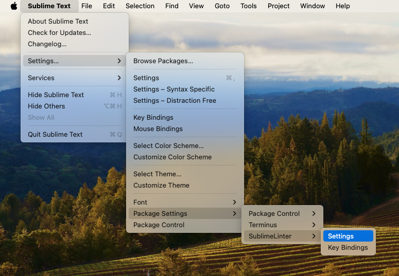
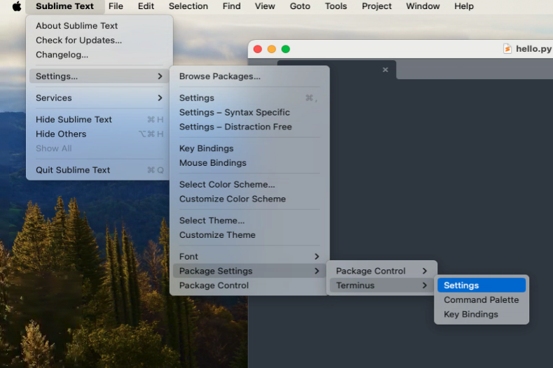
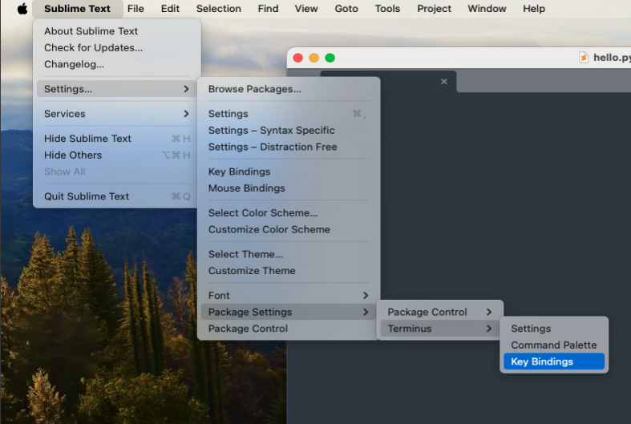

# macOS Setup Guide

This guide sets up macOS, Sublime Text, Python, and Haskell.

> **Note:** If you cannot install local tools, use the **[GitHub Codespaces (CS111 Fundamentals of Programming Template)](https://github.com/codespaces/new?hide_repo_select=true&repo=kittipitch/26cs111codespaces)**.

## Table of Contents

- [Resources](#resources)
- [System Setup](#system-setup)
- [Python 3.12](#python-312)
- [Sublime Text](#sublime-text)
- [mypy & Terminus](#mypy--terminus)
- [Haskell](#haskell)
- [Other Languages](#other-languages)
- [Additional Tools](#additional-tools)

---

## Resources

- **CS Wiki**: cs-wiki101
- **Homebrew**: <https://brew.sh>
- **GitHub**: [instructions](https://docs.github.com)

---

## System Setup

### 1. Install Homebrew

Homebrew installs programming tools on macOS. We use it so students can install the same tools with the same commands.

If you haven't already, install Homebrew:

```bash
/bin/bash -c "$(curl -fsSL https://raw.githubusercontent.com/Homebrew/install/HEAD/install.sh)"
```

### 2. Install basic tools

These are common tools used by Python, Haskell, and command-line programs.

```bash
brew install git bash-completion tmux byobu coreutils pipx pipenv wget curl gnupg mypy bat vim neovim emacs dos2unix kdiff3
```

### 3. Install basic dot files

These settings make the terminal easier to use in this course.

```bash
git clone --depth 1 https://github.com/kittipitch/ubuntu_home.git /tmp/temp
cd /tmp/temp/
# Note: On macOS, we only move the config files that are compatible
cp .bash_profile ~/
cp .dircolors ~/
cp .gitconfig ~/
cp -r .emacs.d ~/
cp -r .config ~/
source ~/.bash_profile
cd
```

### 4. Install programming fonts

```bash
brew tap homebrew/cask-fonts
brew install --cask font-fira-code font-iosevka-nerd-font
```

### 5. Install Base16 color scheme

```bash
git clone https://github.com/tinted-theming/tinted-shell.git "$HOME"/.config/tinted-shell
```

---

## Python 3.12

### 6. Python 3.12

macOS comes with a system Python, but we need 3.12 specifically.

> **Why this matters:** macOS includes its own Python 3 (which changes with OS updates), and Homebrew may install newer versions (3.13, 3.14, etc.). CS courses require **Python 3.12** specifically. These steps ensure `python3` always points to 3.12.

#### Option 1: Using Homebrew (recommended)

```bash
brew install python@3.12
```

Add Python 3.12 to the **front** of your PATH. This ensures `python3` and `pip3` point to the 3.12 version:

```bash
# For Apple Silicon (M1/M2/M3):
echo 'export PATH="/opt/homebrew/opt/python@3.12/libexec/bin:$PATH"' >> ~/.zshrc

# OR for Intel Macs:
# echo 'export PATH="/usr/local/opt/python@3.12/libexec/bin:$PATH"' >> ~/.zshrc

source ~/.zshrc
```

**Immediately verify:**

```bash
python3 --version   # MUST show Python 3.12.x
which python3       # Should show .../python@3.12/libexec/bin/python3
pip3 --version      # Should reference 3.12
```

#### Option 2: Official installer

Download the macOS installer from <https://www.python.org/downloads/> and choose a **Python 3.12.x** release. Do not choose Python 3.13 or newer for this course.

After installing, add aliases to your shell (more reliable than symlinks):

```bash
echo 'alias python3=/usr/local/bin/python3.12' >> ~/.zshrc
echo 'alias pip3=/usr/local/bin/pip3.12' >> ~/.zshrc
source ~/.zshrc
```

**Verify:**

```bash
python3 --version   # MUST show Python 3.12.x
which python3       # Should show /usr/local/bin/python3.12
```

### 7. Install uv

`uv` is a fast Python package manager. It helps install Python packages quickly and safely.

```bash
brew install uv
```

---

## Sublime Text

### 8. Install Sublime Text 4

Sublime Text is the editor used in this guide.

Download: <https://www.sublimetext.com/download>

### 9. Configure Sublime Text for Python

Make Sublime Text use 4 spaces for Python:

1. Create a `hello.py` file
2. Add content:

   ```python
   #!/usr/bin/env python3
   print("Hello world!!")
   ```

3. Save, then go to **Settings... → Settings - Syntax Specific**
4. Add:

   ```json
   {
      "tab_size": 4,
      "translate_tabs_to_spaces": true,
   }
   ```

5. Save (⌘ + S)

### 10. Configure Git (Global)

Ensure your Git identity is set up correctly:

```bash
git config --global user.name "Your Name"
git config --global user.email "your.email@example.com"
```

### 11. Exit Editors (Misc)

If you are stuck in a terminal editor:

- **nano**: Press **Ctrl + X**, then **Y**, then **Enter** to save and exit.
- **emacs**: Press **Ctrl + X**, then **Ctrl + C** to exit.
- **vim**: Press **Esc**, then type `:q!` and press **Enter** to exit without saving.

### 12. Test Python

Create `hello.py`:

```python
print("Hello world!!")
```

Run:

```bash
python3 hello.py
```

---

## mypy & Terminus

### 13. Installing and Configuring mypy on Sublime Text

Static type checking helps find Python mistakes before you run the program.

#### 13.1 Verify mypy installation

`mypy` was already installed in **Step 2** (Installing basic tools). You can verify it now in your terminal:

```bash
mypy --version
```

#### 13.2 Install SublimeLinter and SublimeLinter-mypy

SublimeLinter shows Python type errors inside Sublime Text.

1. **Ctrl + Shift + P** → "Package Control: Add Repository"
- Paste: `https://github.com/SublimeLinter/SublimeLinter`
- Hit Enter

2. **Add Repository** again but this time is for SublimeLinter-mypy
- **Ctrl + Shift + P** → "Package Control: Add Repository"
- Paste: `https://github.com/SublimeLinter/SublimeLinter-mypy`
- Hit Enter

3. **Ctrl + Shift + P** → "Package Control: Install Package"


4. Type "SublimeLinter" and hit Enter.


5. **Ctrl + Shift + P** → "Package Control: Install Package"
6. Type "SublimeLinter-mypy" and hit Enter.


#### 13.3 Configure SublimeLinter

Go to **Settings... → Package Settings → SublimeLinter → Settings** and add to the right panel:



```json
{
  "linters": {
    "mypy": {
      "disable": false,
      "executable": ["mypy"],
      "args": ["--ignore-missing-imports"],
      "python": "3.12"
    }
  }
}
```

#### 13.4 Verify it works

To verify that `mypy` is correctly configured:

1. Create a `test_mypy.py` file in Sublime Text:

   ```python
   #!/usr/bin/env python3

   def hello() -> str:
       return 10
   ```

2. **Save the file.** You should immediately see a red dot or error underline.
3. Hover over the error to see the `mypy` message: **"Incompatible return value type (got 'int', expected 'str')"**, as shown below.

   

4. Change `return 10` to `return "hello"` and save — the error should disappear.

### 14. Installing Terminus on Sublime Text

Terminus adds a terminal inside Sublime Text. You can run commands without changing windows.

#### 14.1 Install Package Control

- **⌘ + Shift + P**
- Type "Install Package Control" and hit Enter

#### 14.2 Add Package Control Channel (if needed)

- **⌘ + Shift + P**
- Type "Package Control: Add Channel" and hit Enter
- Paste: `https://packages.sublimetext.io/channel.json`
- Hit Enter

#### 14.3 Install Terminus

- **⌘ + Shift + P**
- Type "Package Control: Install Package" and hit Enter
- Type "Terminus" and hit Enter


#### 14.4 Satisfy Dependencies

- **Ctrl + Shift + P**
- Type "**Package Control: Satisfy Dependencies**" and hit Enter

#### 14.5 Configure Terminus

- Go to **Settings... → Package Settings → Terminus → Settings**




- Edit the right panel and add:

```json
{
    "default_config": {
        "linux": "Bash",
        "osx": "Zsh",
        "windows": "Command Prompt"
    }
}
```

#### 14.6 Set keyboard shortcuts

- Go to **Settings... → Key Bindings**




- Edit the right panel and add:

```json
[
  {
    "keys": ["alt+`"],
    "command": "toggle_terminus_panel",
    "args": {
      "config_name": null,
      "cwd": "${file_path:${folder}}"
    }
  }
]
```

#### 14.7 Restart Sublime Text

Now you can use **Alt + `** to open a zsh terminal in Sublime Text.


---

## Haskell

### 15. Haskell Setup via GHCup

GHCup installs and manages Haskell tools.
It installs GHC, which is the Haskell compiler.

1. Open your terminal and run:

   ```bash
   curl --proto '=https' --tlsv1.2 -sSf https://get-ghcup.haskell.org | sh
   ```

2. During the installation, answer `y` (Yes) to most questions, except:
   - **Base channel**: select `g` (GHCup maintained)
   - **Pre-releases / Cross channel**: answer `n` (No)
   - **PATH**: select `a` (Append) or `p` (Prepend)

3. Once completed, load the new PATH:

   ```bash
   source ~/.zshrc
   ```

4. Verify the installation:

   ```bash
   ghcup --version
   ghc --version
   ```

5. Install the course versions of `stack`, Haskell Language Server, and `HUnit`:

   The autojudge uses fixed software versions. We install the same versions here so your computer behaves like the judge. `stack` builds Haskell packages. Haskell Language Server gives editor errors and hints. `HUnit` is used for Haskell tests.

   ```bash
   ghcup install ghc 9.6.7
   ghcup set ghc 9.6.7
   ghcup install cabal 3.14.2.0
   ghcup set cabal 3.14.2.0
   ghcup install stack 3.7.1
   ghcup set stack 3.7.1
   ghcup install hls 2.13.0.0
   ghcup set hls 2.13.0.0
   cabal update
   cabal install --lib HUnit-1.6.2.0 --force-reinstalls
   ```

### 16. Configure Sublime Text for Haskell

This setup is **mandatory** for CS115. It gives Sublime Text Haskell formatting and error checking.

1. **Install Ormolu** (the Haskell code formatter) using stack:

   Ormolu formats Haskell code so everyone uses the same style.

   ```bash
   stack install ormolu-0.7.2.0 --resolver lts-22.44
   ```

   Check that Haskell Language Server and Ormolu are available:

   ```bash
   source ~/.ghcup/env
   haskell-language-server-wrapper --version
   ormolu --version
   ```

2. Make Sublime Text use 2 spaces for Haskell indentation:
   - Save a blank file as `test.hs`. This tells Sublime Text that the file is Haskell.
   - Go to **Settings... → Settings - Syntax Specific**.
   - Add the following configuration:

   ```json
   {
      "tab_size": 2,
      "translate_tabs_to_spaces": true
   }
   ```

3. Install LSP in Sublime Text:

   LSP lets Sublime Text talk to Haskell Language Server.

   - Press **⌘ + Shift + P**
   - Select **Package Control: Install Package**
   - Search for and install **LSP**

4. Configure LSP for Haskell:
   - Open command palette again and search for **LSP: Settings**
   - Add the following configuration:

   ```json
   // Settings in here override those in "LSP/LSP.sublime-settings"

   {
     "lsp_format_on_save": true,

     "clients": {
       "haskell-language-server": {
         "enabled": true,
         "command": [
           "bash",
           "-c",
           "source ~/.ghcup/env && haskell-language-server-wrapper --lsp"
         ],
         "selector": "source.haskell",
         "settings": {
           "haskell.formattingProvider": "ormolu"
         }
       }
     }
   }
   ```

   > **Note:** This command loads GHCup first, then starts Haskell Language Server. HLS gives Sublime Text Haskell errors and formatting. The separate `ormolu` install above gives you the course version of the command-line formatter.

5. Restart Sublime Text, or open the command palette and run **LSP: Restart Servers**.

### 17. Create and Run a Haskell File (Hello World)

1. Create a `Hello.hs` file in Sublime Text:

   This checks that GHC can run a simple Haskell program.

   ```haskell
   main :: IO ()
   main = putStrLn "Hello Haskell!!"
   ```

2. Run the file:

   ```bash
   runghc Hello.hs
   ```

### 18. Verify Ormolu and LSP

After the basic test works, create `TestSetup.hs` to test LSP.
This checks formatting and error messages inside Sublime Text.

1. Create a `TestSetup.hs` file in Sublime Text:

   ```haskell
   -- 1. Test LSP formatting (Ormolu):
   --    Try to mess up indentation or remove spaces around '=',
   --    then save the file. It should auto-format on save.
   x = 1 + 2

   -- Intentional type error to test LSP - uncomment
   -- badValue :: Int
   -- badValue = "this is not an int"

   main :: IO ()
   main = putStrLn "LSP is working!"
   ```

2. **Save the file** and check if it auto-formats.
3. Remove the `--` before the `badValue` lines and save. You should see a red error underline or dot. Move your mouse over it to see the error message.

   

4. Add the `--` back and save the file. The error should disappear.
5. Run the file:

   ```bash
   runghc TestSetup.hs
   ```

---

## Other Languages

### 18. Java Setup

```bash
brew install openjdk@21
```

### 19. C/C++ Setup

```bash
brew install gcc
```

For using g++-1x as the default compiler on macOS:

```bash
brew upgrade
sudo rm /usr/local/bin/gcc
sudo rm /usr/local/bin/g++
sudo ln -s /opt/homebrew/bin/gcc-1* /usr/local/bin/gcc
sudo ln -s /opt/homebrew/bin/g++-1* /usr/local/bin/g++
```

### 20. NodeJS Setup

```bash
brew install node@24
echo 'export PATH="/opt/homebrew/opt/node@24/bin:$PATH"' >> ~/.zshrc
source ~/.zshrc
```

### 21. Go Setup

```bash
brew install go
```

### 22. Hello World in Go

`hello.go`:

```go
package main
import "fmt"
func main() {
    fmt.Println("Hello world!")
}
```

Run:

```bash
go run hello.go
```

---

## Additional Tools

### 23. VSCode Installation

Download: <https://code.visualstudio.com/download>

### 24. Install OrbStack (Docker for Mac)

OrbStack is a fast, light, and easy replacement for Docker Desktop.

```bash
brew install --cask orbstack
```

### 25. Install lazydocker

```bash
brew install jesseduffield/lazydocker/lazydocker
```

### 26. Install fzf

```bash
brew install fzf
$(brew --prefix)/opt/fzf/install
```

### 27. Install GitHub CLI

```bash
brew install gh
```

---

## Useful Tips

### Opening Terminal at current directory

**Finder → Right-click folder → "New Terminal at Folder"**

---

*For issues or questions, refer to your course-specific instructions or wiki.*
