# Ubuntu 24.04 Setup Guide

Complete setup for native Ubuntu 24.04 - dual-boot or native Linux.

> **Note:** If you cannot install local tools, use the **[GitHub Codespaces (CS111 Fundamentals of Programming Template)](https://github.com/codespaces/new?hide_repo_select=true&repo=kittipitch/26cs111codespaces)**.

> **Automated Setup:** You can run the **[ubuntu_user_install.sh](ubuntu_user_install.sh)** script to automate most of these steps.

## Table of Contents

- [System Setup](#system-setup)
- [Basic Tools](#basic-tools)
- [Sublime Text](#sublime-text)
- [Python](#python)
- [Haskell](#haskell)
- [Java](#java)
- [C/C++](#cc)
- [NodeJS & Go](#nodejs--go)
- [Additional Tools](#additional-tools)
- [Appendices](#appendices)

---

## System Setup

### 1. Update system

```bash
sudo apt update && sudo apt upgrade -y
```

### 2. Install basic tools

```bash
sudo apt install -y tar zip unzip git build-essential python3-pip python3-venv pipenv tmux mypy dos2unix xclip emacs-nox vim neovim bat wget curl gnupg ca-certificates kdiff3
```

### 3. Install basic dot files

```bash
git clone --depth 1 https://github.com/kittipitch/ubuntu_home.git /tmp/temp
cd /tmp/temp/
mv .bashrc ~/
mv .bash_profile ~/
mv .dircolors ~/
mv .gitconfig ~/
mv .emacs.d ~/
mv .config ~/
source ~/.bash_profile
cd
```

### 4. Install programming fonts

```bash
# Install font manager
sudo apt install fonts-firacode
# Or optionally install IosevkaTerm Nerd Font
cd ~/Downloads
wget https://github.com/ryanoasis/nerd-fonts/releases/download/v3.2.1/IosevkaTerm.zip
unzip IosevkaTerm.zip -d iosevka
sudo mkdir -p /usr/share/fonts/truetype/iosevka/
sudo cp iosevka/*.ttf /usr/share/fonts/truetype/iosevka/
sudo fc-cache -f -v
dconf write /org/gnome/terminal/legacy/profiles:/:b1dcc9dd-5262-4d8d-a863-c897e6d979b9/font "'IosevkaTerm Nerd Font Mono 15'"
dconf write /org/gnome/terminal/legacy/profiles:/:b1dcc9dd-5262-4d8d-a863-c897e6d979b9/use-system-font false
```

---

## Basic Tools

### 5. Install Base16 color scheme

```bash
git clone https://github.com/tinted-theming/tinted-shell.git "$HOME"/.config/tinted-shell
```

### 6. Check Python

```bash
python3 --version
```

### 7. Upgrade pip

```bash
python3 -m pip install --upgrade pip
```

### 8. Install NumPy and Pandas

```bash
pip install numpy pandas
```

---

## Sublime Text

### 9. Install Sublime Text 4

Download: <https://www.sublimetext.com/download>

### 10. Configure Sublime Text for Python

Make Sublime Text use 4 spaces for Python:

1. Create a `hello.py` file
2. Add content:

   ```python
   #!/usr/bin/env python3
   print("Hello world!!")
   ```

3. Save, then go to **Preferences → Settings - Syntax Specific**
4. Add:

   ```json
   {
      "tab_size": 4,
      "translate_tabs_to_spaces": true,
   }
   ```

5. Save (Ctrl+S)

### 11. Configure Git (Global)

Ensure your Git identity is set up correctly:

```bash
git config --global user.name "Your Name"
git config --global user.email "your.email@example.com"
```

### 12. Exit Editors (Misc)

If you are stuck in a terminal editor:

- **nano**: Press **Ctrl + X**, then **Y**, then **Enter** to save and exit.
- **emacs**: Press **Ctrl + X**, then **Ctrl + C** to exit.
- **vim**: Press **Esc**, then type `:q!` and press **Enter** to exit without saving.

### 13. Test Python

Create `hello.py`:

```python
print("Hello world!!")
```

Run:

```bash
python3 hello.py
```

### 14. Installing and Configuring mypy on Sublime Text

Static type checking for Python ensures your code is bug-free before you run it.

#### 14.1 Verify mypy installation

`mypy` was already installed in **Step 2** (Installing basic tools). You can verify it now in your terminal:

```bash
mypy --version
```

If it shows a version (e.g. `mypy 1.8.0`), proceed to the next step. Otherwise, install it now:

```bash
sudo apt update && sudo apt install -y mypy
```

#### 14.2 Install SublimeLinter and SublimeLinter-mypy

1. **Ctrl + Shift + P** → "Package Control: Install Package"
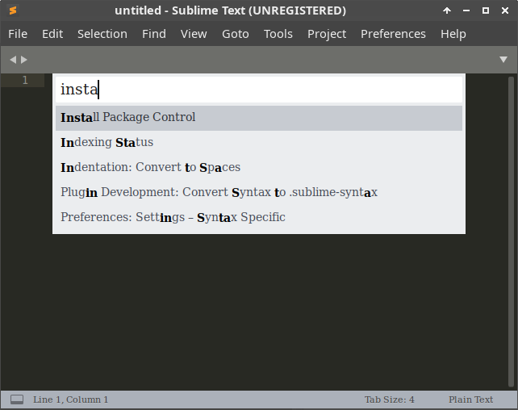

2. Type "SublimeLinter" and hit Enter.
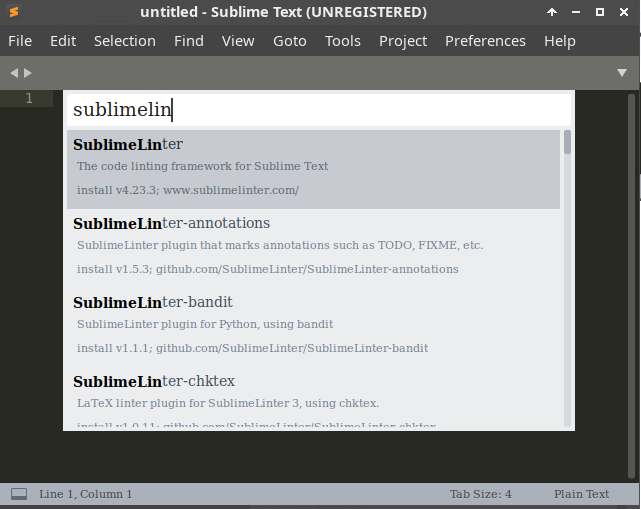

3. **Ctrl + Shift + P** → "Package Control: Install Package"
4. Type "SublimeLinter-mypy" and hit Enter.
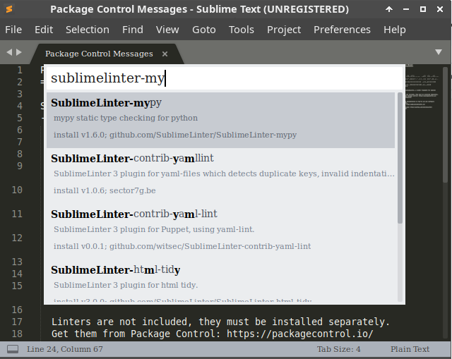

#### 14.3 Configure SublimeLinter

Go to **Preferences → Package Settings → SublimeLinter → Settings** and add to the right panel:

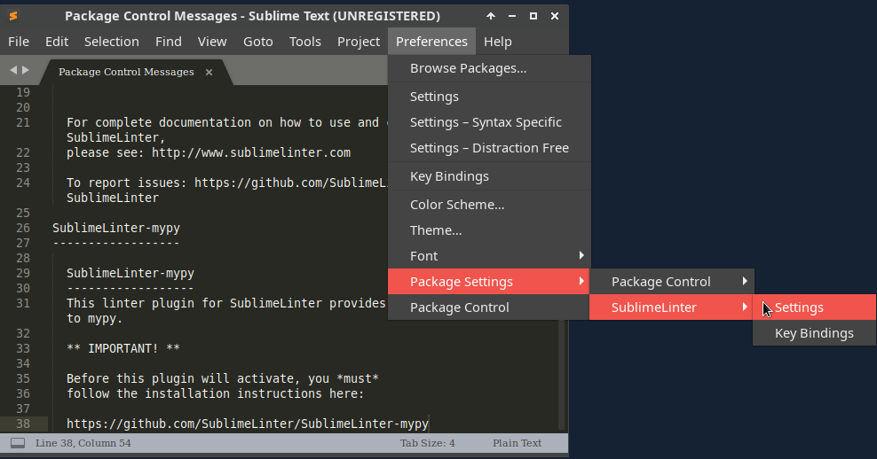

```json
{
  "linters": {
    "mypy": {
      "disable": false,
      "executable": ["mypy"],
      "args": ["--ignore-missing-imports"],
      "python": "3.12"
    }
  }
}
```

#### 14.4 Verify it works

To verify that `mypy` is correctly configured:

1. Create a `test_mypy.py` file in Sublime Text:

   ```python
   #!/usr/bin/env python3

   def hello() -> str:
       return 10
   ```

2. **Save the file.** You should immediately see a red dot or error underline.
3. Hover over the error to see the `mypy` message: **"Incompatible return value type (got 'int', expected 'str')"**, as shown below.

   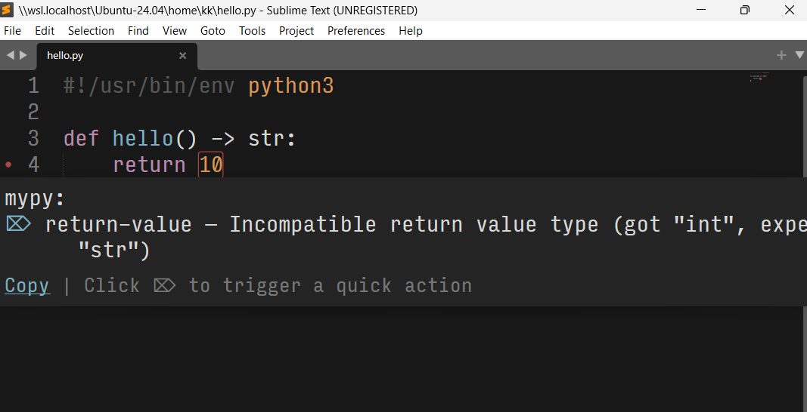

4. Change `return 10` to `return "hello"` and save — the error should disappear.

### 15. Installing Terminus on Sublime Text

Terminus provides an integrated terminal within Sublime Text.

#### 15.1 Install Package Control

- **Ctrl + Shift + P**
- Type "Install Package Control" and hit Enter

#### 15.2 Add Package Control Channel (if needed)

- **Ctrl + Shift + P**
- Type "Package Control: Add Channel" and hit Enter
- Paste: `https://packages.sublimetext.io/channel.json`
- Hit Enter

#### 15.3 Install Terminus

- **Ctrl + Shift + P**
- Type "Package Control: Install Package" and hit Enter
- Type "Terminus" and hit Enter


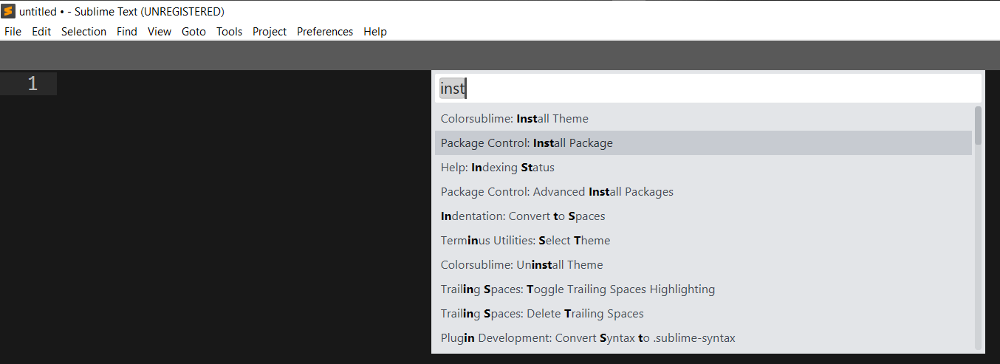

#### 15.4 Configure Terminus

- Go to **Preferences → Package Settings → Terminus → Settings**

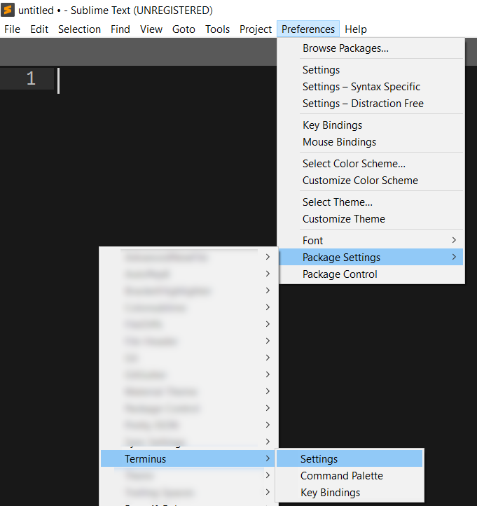

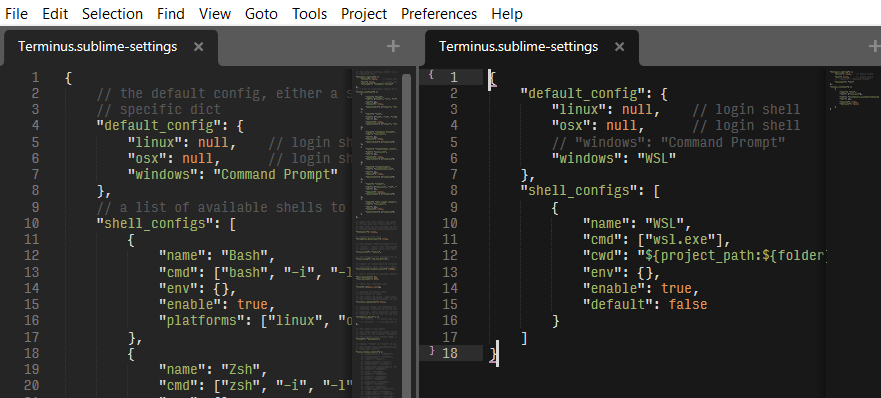

- Edit the right panel and add:

```json
{
    "default_config": {
        "linux": "Bash",
        "osx": "Zsh",
        "windows": "Command Prompt"
    }
}
```

#### 15.5 Set keyboard shortcuts

- Go to **Preferences → Key Bindings**

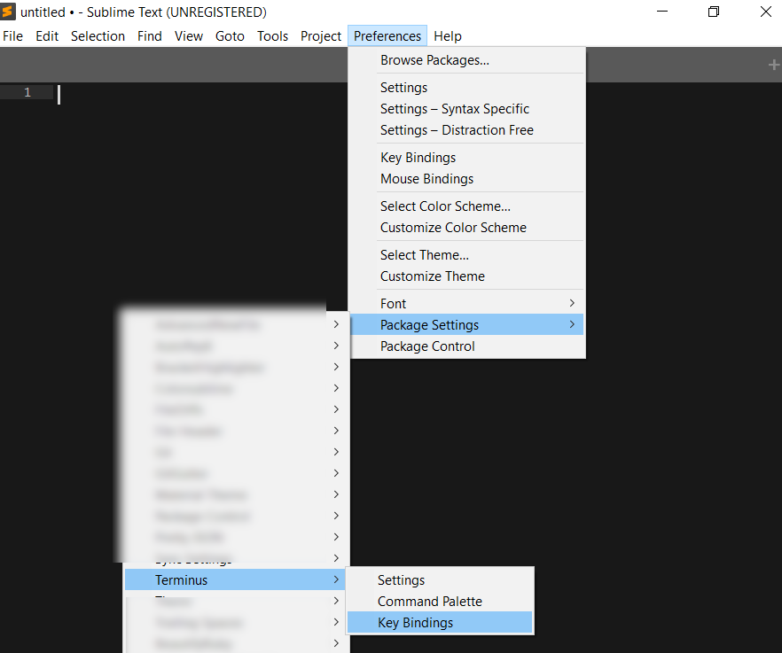

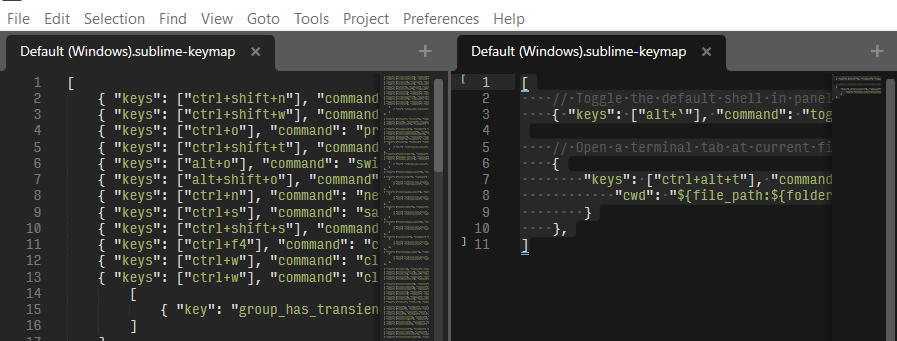

- Edit the right panel and add:

```json
[
  {
    "keys": ["alt+`"],
    "command": "toggle_terminus_panel",
    "args": {
      "config_name": null,
      "cwd": "${file_path:${folder}}"
    }
  }
]
```

#### 15.6 Ubuntu only - disable conflicting shortcut

This command ensures the OS doesn't intercept **Alt + `** (which is normally used to switch between windows of the same application).

```bash
gsettings set org.gnome.desktop.wm.keybindings switch-group "['<Super>Above_Tab']"
```

#### 15.7 Restart Sublime Text

Now you can use **Alt + `** to open a bash terminal in Sublime Text.

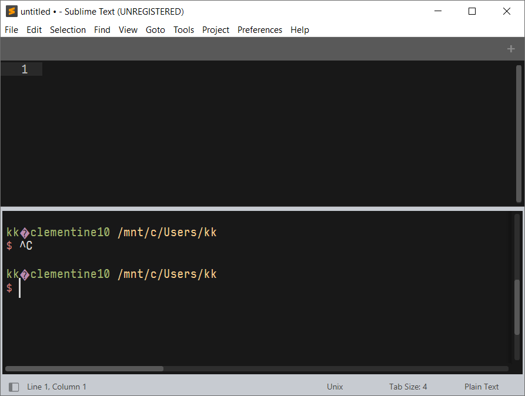

---

## Haskell

### 16. Haskell Setup via GHCup

We will install GHCup, which manages Haskell compilers and tools.

0. Install dependencies:

   ```bash
   sudo apt install build-essential curl libffi-dev libffi8 libgmp-dev libgmp10 libncurses-dev pkg-config
   ```

1. Open your terminal and run:

   ```bash
   curl --proto '=https' --tlsv1.2 -sSf https://get-ghcup.haskell.org | sh
   ```

2. During the installation, answer `y` (Yes) to most prompts, except:
   - **Base channel**: select `g` (GHCup maintained)
   - **Pre-releases / Cross channel**: answer `n` (No)
   - **PATH**: select `a` (Append) or `p` (Prepend)

3. Once completed, load the new PATH:

   ```bash
   source ~/.bashrc
   ```

4. Verify the installation:

   ```bash
   ghcup --version
   ghc --version
   ```

5. Install `stack` and `HUnit`:

   ```bash
   ghcup install stack latest
   cabal update
   cabal install --lib HUnit
   ```

### 17. Configure Sublime Text for Haskell

This setup is **mandatory** for CS115 to ensure proper code formatting and error checking.

1. **Install Ormolu** (Haskell code formatter) globally using stack:

   ```bash
   stack install ormolu-0.7.2.0 --resolver lts-22.44
   ```

2. Make Sublime Text use 2 spaces for Haskell indentation:
   - Save a blank file as `test.hs` to trigger the Haskell syntax, then go to **Preferences → Settings - Syntax Specific**.
   - Add the following configuration:

   ```json
   {
      "tab_size": 2,
      "translate_tabs_to_spaces": true
   }
   ```

3. Connect to the Haskell LSP (Language Server Protocol):
   - Press **Ctrl + Shift + P**
   - Select **Package Control: Install Package**
   - Search for and install **LSP**

4. Configure the LSP settings for Haskell:
   - Open command palette again and select **Preferences: LSP Settings**
   - Add the following configuration:

   ```json
   // Settings in here override those in "LSP/LSP.sublime-settings"

   {
     "lsp_format_on_save": true,

     "clients": {
       "haskell-language-server": {
         "enabled": true,
         "command": [
           "bash",
           "-c",
           "source ~/.ghcup/env && haskell-language-server-wrapper --lsp"
         ],
         "selector": "source.haskell",
         "settings": {
           "haskell.formattingProvider": "ormolu"
         }
       }
     }
   }
   ```

   > **Note:** We use `bash -c "source ~/.ghcup/env && ..."` so that bash expands `~` and sets up the ghcup PATH correctly. Using `"env": {"PATH": "$HOME/..."}` does **not** work because JSON does not expand shell variables.

### 18. Create and Run a Haskell File (Hello World)

1. Create a `Hello.hs` file in Sublime Text:

   ```haskell
   main :: IO ()
   main = putStrLn "Hello Haskell!!"
   ```

2. Run the file:

   ```bash
   runghc Hello.hs
   ```

### 19. Verify Ormolu and LSP

Once you have verified the basic setup, create a `TestSetup.hs` to see the LSP in action.

1. Create a `TestSetup.hs` file in Sublime Text:

   ```haskell
   -- 1. Test LSP formatting (Ormolu):
   --    Try to mess up indentation or remove spaces around '=',
   --    then save the file. It should auto-format on save.
   x = 1 + 2

   -- Intentional type error to test LSP - uncomment
   -- badValue :: Int
   -- badValue = "this is not an int"

   main :: IO ()
   main = putStrLn "LSP is working!"
   ```

2. **Save the file** and check if it auto-formats.
3. **Uncomment** the `badValue` lines and save. You should see a red error underline or dot. Hover over it to see the error message (as shown below).

   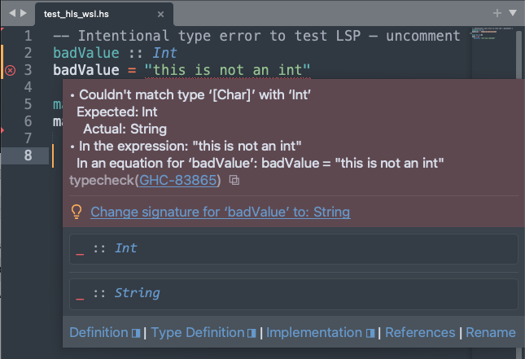

4. Comment it back and save the file — the error should disappear.
5. Run the file:

   ```bash
   runghc TestSetup.hs
   ```

---

## Java

### 20. Java Setup

#### 20.1 Install JDK 21

```bash
sudo apt install openjdk-21-jdk
```

#### 20.2 Check Java version

```bash
java -version
```

#### 20.3 Create Java file

`Hello.java`:

```java
public class Hello {
    public static void main(String[] args) {
        System.out.println("Hello world!!");
    }
}
```

#### 20.4 Compile and Run

```bash
javac Hello.java
java Hello
```

---

## C/C++

### 21. C/C++ Setup

#### 21.1 Install build-essential

```bash
sudo apt install build-essential
```

#### 21.2 Check g++ version

```bash
g++ --version
```

#### 21.3 Create C++ file

`hello.cpp`:

```cpp
#include <iostream>
using namespace std;

int main() {
    cout << "Hello world!!" << endl;
    return 0;
}
```

#### 21.4 Compile and Run

```bash
g++ -o hello hello.cpp
./hello
```

---

## NodeJS & Go

### 22. NodeJS Setup

**Install prerequisites:**

```bash
sudo apt install curl gnupg ca-certificates
```

**Create keyrings directory:**

```bash
sudo mkdir -p /etc/apt/keyrings
```

**Add NodeSource repository for Node.js 24 LTS:**

```bash
curl -fsSL https://deb.nodesource.com/setup_24.x | sudo -E bash -
```

**Install NodeJS:**

```bash
sudo apt install nodejs
```

**OR Install Bun 1.3.11 (instead of NodeJS):**

```bash
[[ -d ~/Downloads ]] || mkdir ~/Downloads
cd ~/Downloads
wget https://github.com/oven-sh/bun/releases/download/bun-v1.3.11/bun-linux-x64.zip --no-check-certificate
unzip bun-linux-x64.zip
sudo cp bun-linux-x64/bun /usr/bin/
bun --version  # Should show 1.3.11
```

### 23. Go Setup

**Download Go 1.19.13:**

```bash
wget https://go.dev/dl/go1.19.13.linux-amd64.tar.gz
```

**Remove old installations:**

```bash
sudo rm -rf /usr/local/go
```

**Install Go:**

```bash
sudo tar -C /usr/local -xzf go1.19.13.linux-amd64.tar.gz
```

**Add to PATH** (`~/.bashrc`):

```bash
export PATH=$PATH:/usr/local/go/bin
```

**Check version:**

```bash
go version
```

### 24. Hello World in Go

`hello.go`:

```go
package main

import "fmt"

func main() {
    fmt.Println("Hello world!!")
}
```

**Run:**

```bash
go run hello.go
```

---

## Additional Tools

### 25. VSCode Installation

- Download: <https://code.visualstudio.com/download>
- Install via `.deb` package

### 26. Install Docker

```bash
# Add Docker repo
sudo install -m 0755 -d /etc/apt/keyrings
sudo curl -fsSL https://download.docker.com/linux/ubuntu/gpg | sudo gpg --dearmor -o /etc/apt/keyrings/docker.gpg
sudo chmod a+r /etc/apt/keyrings/docker.gpg

echo \
  "deb [arch=$(dpkg --print-architecture) signed-by=/etc/apt/keyrings/docker.gpg] https://download.docker.com/linux/ubuntu \
  $(. /etc/os-release && echo "$VERSION_CODENAME") stable" | \
  sudo tee /etc/apt/sources.list.d/docker.list > /dev/null

sudo apt update
sudo apt install docker-ce docker-ce-cli containerd.io docker-buildx-plugin docker-compose-plugin
```

### 27. Install fzf

```bash
git clone --depth 1 https://github.com/junegunn/fzf.git ~/.fzf
~/.fzf/install
```

### 28. Install Clean Utility (Optional)

```bash
[[ -d ~/Downloads ]] || mkdir ~/Downloads
cd ~/Downloads
wget -O clean.tar.bz2 https://sourceforge.net/projects/clean/files/clean/3.4/clean-3.4.tar.bz2/download
tar xvf clean.tar.bz2
cd clean-3.4
make all
sudo make install
cd
```

### 29. Install GitHub CLI

```bash
(type -p wget >/dev/null || (sudo apt update && sudo apt-get install wget -y)) && \
  sudo mkdir -p -m 755 /etc/apt/keyrings && \
  wget -qO- https://cli.github.com/packages/githubcli-archive-keyring.gpg | sudo tee /etc/apt/keyrings/githubcli-archive-keyring.gpg > /dev/null && \
  sudo chmod go+r /etc/apt/keyrings/githubcli-archive-keyring.gpg && \
  echo "deb [arch=$(dpkg --print-architecture) signed-by=/etc/apt/keyrings/githubcli-archive-keyring.gpg] https://cli.github.com/packages stable main" | sudo tee /etc/apt/sources.list.d/github-cli.list > /dev/null && \
  sudo apt update && sudo apt install gh -y
```

---

## Appendices

### Appendix A: Install Code Formatter for Python on VSCode

1. **Install autopep8:**

   ```bash
   sudo pip3 install --upgrade autopep8
   ```

2. **Configure VSCode settings:**

   ```bash
   code ~/.config/Code/User/settings.json
   ```

   Or edit via: **Settings → Open Settings (JSON)**

3. **Edit the file and add:**

   ```json
   {
       "python.defaultInterpreterPath": "/usr/bin/python3",
       "python.formatting.provider": "autopep8",
       "[python]": {
           "editor.tabSize": 4,
           "editor.insertSpaces": true,
           "editor.formatOnSave": true
       }
   }
   ```

### Appendix B: lazydocker - Terminal UI for Docker

**lazydocker** provides a terminal UI for Docker - no need for Docker Desktop.

If not already installed (done in Step 26), install manually:

```bash
[[ -d ~/Downloads ]] || mkdir ~/Downloads
cd ~/Downloads
LAZYDOCKER_VERSION=$(curl -s "https://api.github.com/repos/jesseduffield/lazydocker/releases/latest" | grep -Po '"tag_name": "v\K[^"]*')
curl -sLo lazydocker.tar.gz "https://github.com/jesseduffield/lazydocker/releases/latest/download/lazydocker_${LAZYDOCKER_VERSION}_Linux_x86_64.tar.gz"
tar xfz lazydocker.tar.gz
sudo mv lazydocker /usr/local/bin
```

**Usage:**

```bash
lazydocker
```

### Appendix C: fzf fuzzy search (Optional)

#### C.1 Install fzf

```bash
git clone --depth 1 https://github.com/junegunn/fzf.git ~/.fzf
~/.fzf/install
```

#### C.2 Use Ctrl + R for fuzzy command history search

---

## Useful Tips

### Opening Terminal at current directory

Right-click → "Open in Terminal"

---

*For issues or questions, refer to your course-specific instructions or wiki.*
