# Windows + WSL Setup Guide

Complete setup for Windows using Sublime Text with WSL (Ubuntu 24.04) backend.

> **Note:** If you cannot install local tools, use the **[GitHub Codespaces (CS111 Fundamentals of Programming Template)](https://github.com/codespaces/new?hide_repo_select=true&repo=kittipitch/26cs111codespaces)**.

> **For CS111 (Python) and CS115 (Haskell) only.** For CS200+ courses (Java, C/C++, Go, NodeJS), use [macOS](MACOS.md) or [Ubuntu](UBUNTU.md) instead.

## Table of Contents

- [Windows Setup](#windows-setup)
- [WSL Installation](#wsl-installation)
- [Windows Terminal](#windows-terminal)
- [Basic Tools](#basic-tools)
- [Sublime Text Configuration](#sublime-text-configuration)
- [Haskell Setup](#haskell-setup)
- [Appendices](#appendices)

---

## Windows Setup

### 1. Change language input hotkey

Change to **Win + Space bar** (or anything else). **DO NOT use 'Grave Accent'** to switch languages.

Also **remove all python installations from your system** before proceeding.

### 2. Install Sublime Text 4

- Download from [here](https://www.sublimetext.com/download)
- Choose `win-x64` for Windows
- Add Sublime Text to Windows Path:
  1. Windows Key + R
  2. Type "sysdm.cpl" and press Enter
  3. Click Advanced → Environment Variables

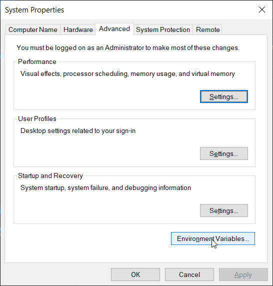
  4. Click on "Path" then Edit

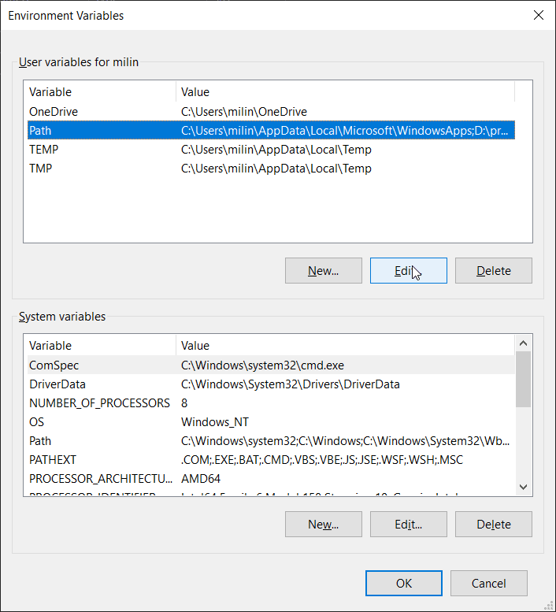
  5. Click New

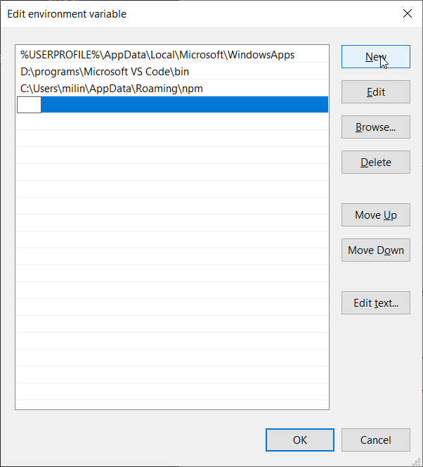
  6. Add path: `C:\Program Files\Sublime Text`

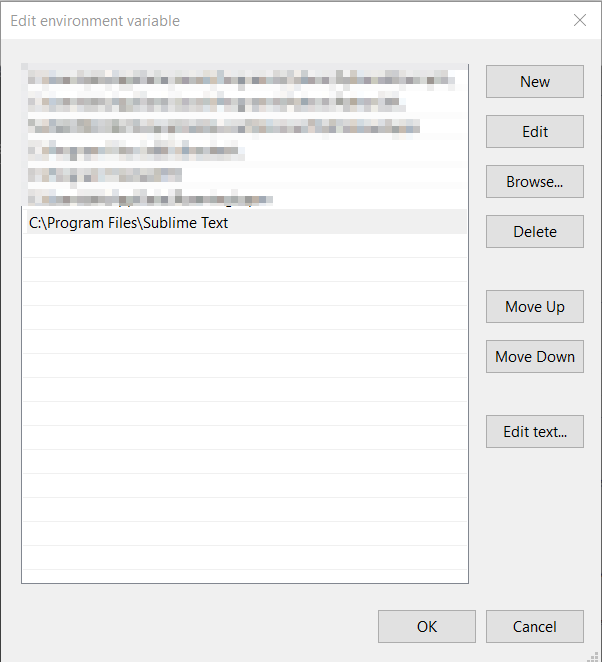

### 3. Configure Sublime Text for Python

Make Sublime Text use 4 spaces for Python:

1. Create a `hello.py` file
2. Add content:

   ```python
   #!/usr/bin/env python3
   print("Hello world!!")
   ```

3. Save, then go to **Preferences → Settings - Syntax Specific**
4. Add:

   ```json
   {
      "tab_size": 4,
      "translate_tabs_to_spaces": true,
   }
   ```

   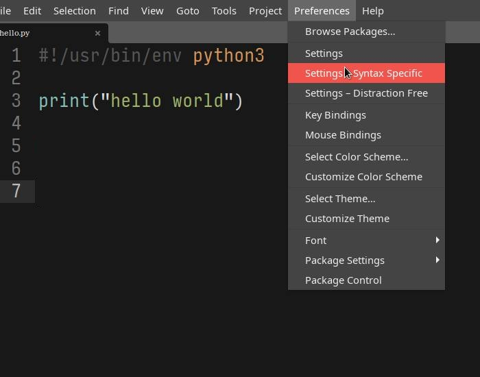

   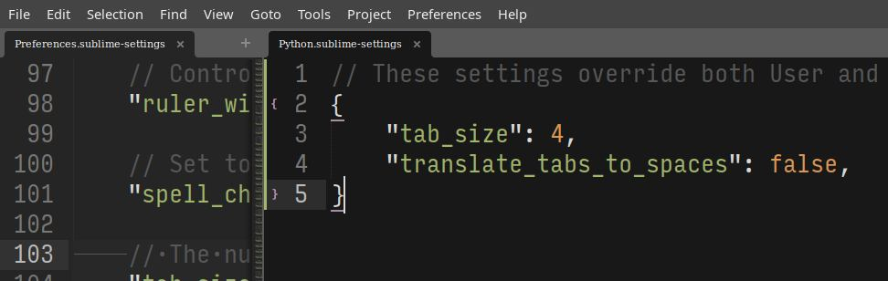

5. Save (Ctrl+S)

### 4. Install Cascadia Terminal Fonts

Download and install fonts with glyphs:
<https://github.com/microsoft/cascadia-code/releases/download/v2404.23/CascadiaCode-2404.23.zip>

1. Extract the downloaded `.zip` file.
2. Select all the font files (`.ttf`).
3. Right-click and choose **Install** (or **Install for all users**).

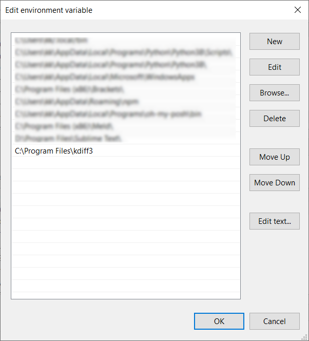

### 5. Install Git for Windows

Download from: <https://gitforwindows.org/>

- Run the downloaded installer.
- You can safely click **Next** through all the prompts to use the default settings and finish the installation.

### 6. Install KDiff3

Install KDiff3 1.11.0: <https://download.kde.org/stable/kdiff3/>

Include `"C:\Program Files\KDiff3\"` and `"C:\Program Files\KDiff3\bin"` in Windows path (see Step 2).

---

## WSL Installation

### 7. Installing WSL - Ubuntu 24.04

#### 7.1 Open PowerShell with administrator privilege

1. Win + R
2. Type "powershell"
3. Ctrl + Shift + Enter
4. Select "Yes" at the pop-up

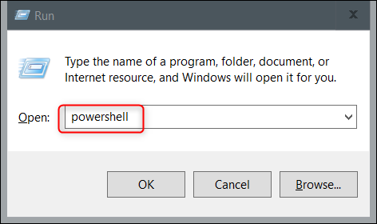

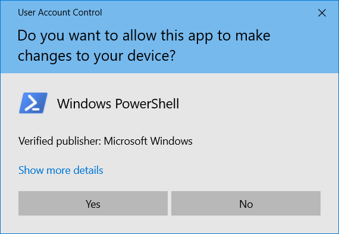

#### 7.2 Enable WSL features

Enable Windows Subsystem for Linux:

```powershell
# PowerShell
dism.exe /online /enable-feature `
/featurename:Microsoft-Windows-Subsystem-Linux /all /norestart
```

Enable Virtual Machine feature:

```powershell
# PowerShell
dism.exe /online /enable-feature `
/featurename:VirtualMachinePlatform /all /norestart
```

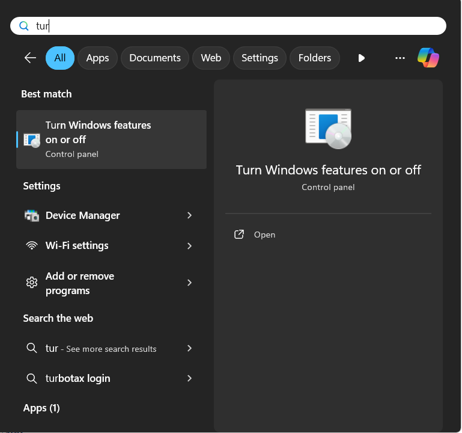

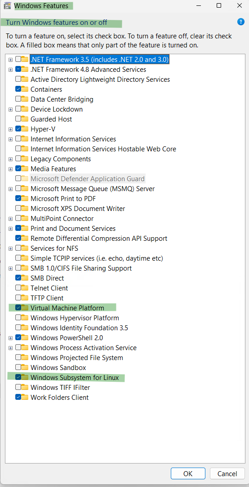

#### 7.3 Download and install Linux kernel update

WSL2 Linux kernel update package for x64 machines

#### 7.4 Install WSL & Ubuntu 24.04

```powershell
# PowerShell
# Update WSL
wsl --update

# Install WSL
wsl --install --no-distribution

# Set WSL 2 as default
wsl --set-default-version 2
```

**Note for Ryzen CPU users with integrated graphics:** If you have issues, use WSL version 1:

```powershell
# PowerShell
wsl --set-default-version 1
```

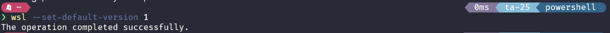

Install Ubuntu 24.04:

```powershell
# PowerShell
wsl --install -d Ubuntu-24.04
```

#### 7.5 Ubuntu Configuration

**Pick a username and password** (password won't display on screen)

**Link Windows' Documents folder to Ubuntu:**

```bash
# Bash/WSL
HOME_DIR=$(wslpath -u $(cmd.exe /c echo %USERPROFILE% | tr -d '\r'))
[[ -e "$HOME_DIR/OneDrive/Desktop" ]] && \
ln -sf "$HOME_DIR/OneDrive/Desktop" ~/ || \
ln -sf "$HOME_DIR/Desktop" ~/
[[ -e "$HOME_DIR/OneDrive/Documents" ]] && \
ln -sf "$HOME_DIR/OneDrive/Documents" ~/ || \
ln -sf "$HOME_DIR/Documents" ~/
ln -sf "$HOME_DIR/Downloads" ~/
```

**(Optional) Move home directory to D: drive:**

```bash
# Bash/WSL
sudo mkdir -p /mnt/d/home/
cd /home
sudo mv $(whoami) /mnt/d/home/
sudo ln -s /mnt/d/home/$(whoami) /home/
```

**Update and upgrade:**

```bash
# Bash/WSL
sudo apt update; sudo apt upgrade -y
```

**Fix permissions:**

```bash
# Bash/WSL
sudo nano /etc/wsl.conf
```

Add:

```ini
[boot]
systemd=true
[automount]
enabled=true
options="metadata,uid=1000,gid=1000,umask=077"
```

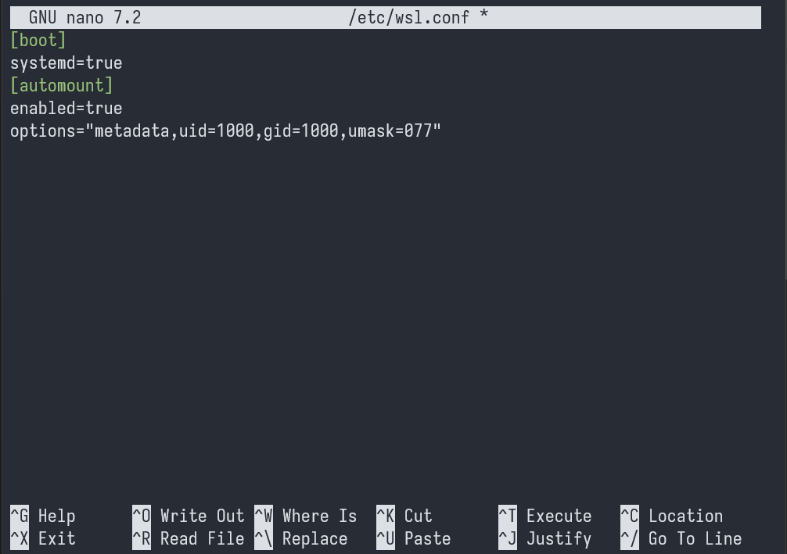

**Limit WSL resources:**

```bash
# Bash/WSL
HOME_DIR=$(wslpath -u $(cmd.exe /c echo %USERPROFILE% | tr -d '\r'))
nano $HOME_DIR/.wslconfig
```

Add:

```ini
[wsl2]
memory=2GB
processors=1
```

**Check WSL version:**

```powershell
# PowerShell
wsl -l -v
```

### 8. Microsoft Defender Exclusions

Reduced "Antimalware Service Executable" (MsMpEng.exe) overhead by ignoring high-activity WSL-related directories and processes.

#### 8.1 Open PowerShell with administrator privilege

1. Win + R
2. Type "powershell"
3. Ctrl + Shift + Enter
4. Select "Yes" at the pop-up

#### 8.2 Add Exclusions

Run the following commands in PowerShell to exclude WSL network paths and core processes:

```powershell
# PowerShell (Admin)
Add-MpPreference -ExclusionPath "\\wsl$"
Add-MpPreference -ExclusionPath "\\wsl.localhost"
Add-MpPreference -ExclusionProcess "vmmemWSL.exe"
Add-MpPreference -ExclusionProcess "wsl.exe"
Add-MpPreference -ExclusionProcess "wslhost.exe"
```

To exclude the virtual disk (.vhdx) folder (replace `[USER]` with your Windows username):

```powershell
# PowerShell (Admin)
Add-MpPreference -ExclusionPath "C:\Users\[USER]\AppData\Local\Packages\CanonicalGroupLimited.Ubuntu24.04LTS_79rhkp1fndgsc\LocalState"
```

---

## Windows Terminal

### 9. Installing Windows Terminal

- Download: <https://aka.ms/terminal>
- Set Default Profile to "Ubuntu-24.04"
- Select Font "CaskaydiaCove Nerd Font" or any Nerd Font variation you like.

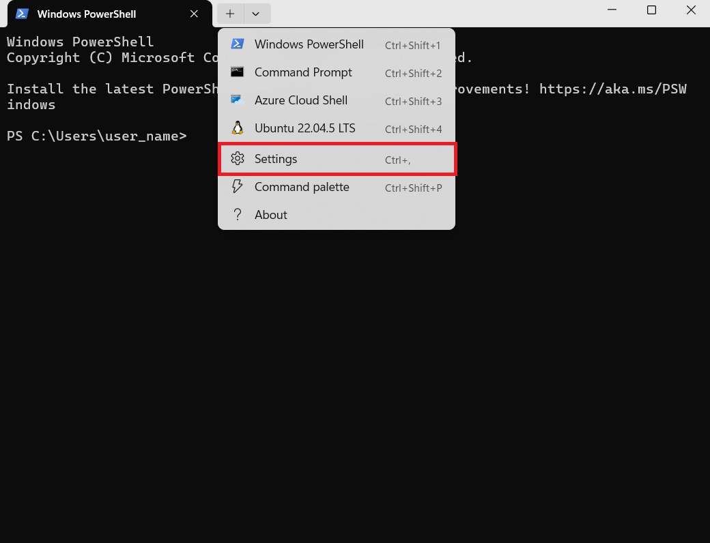

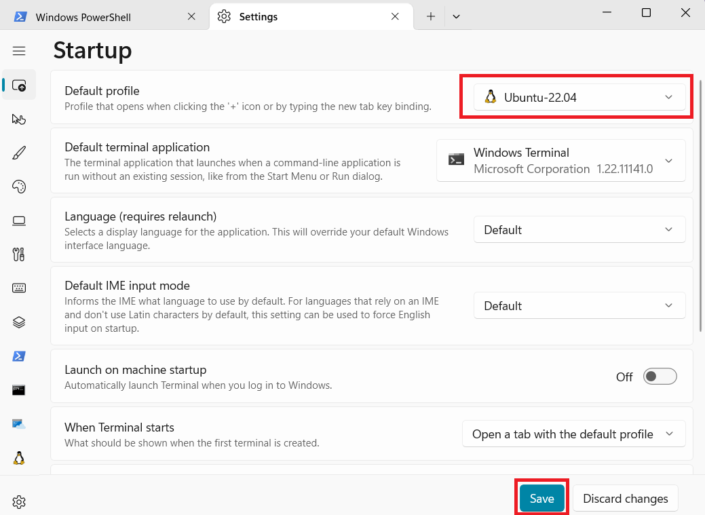

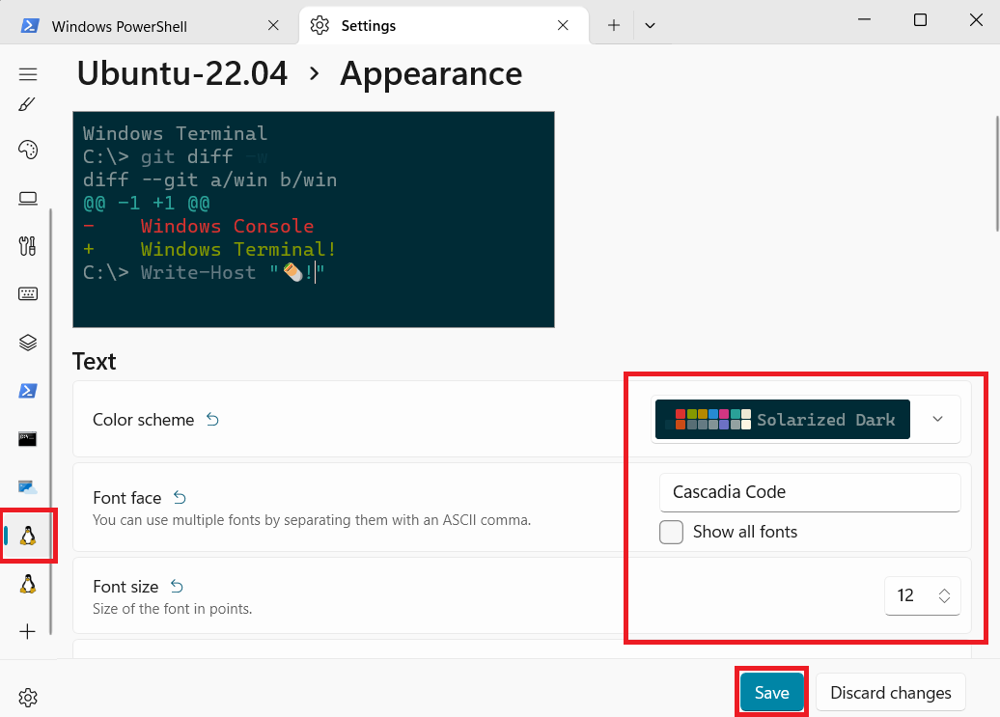

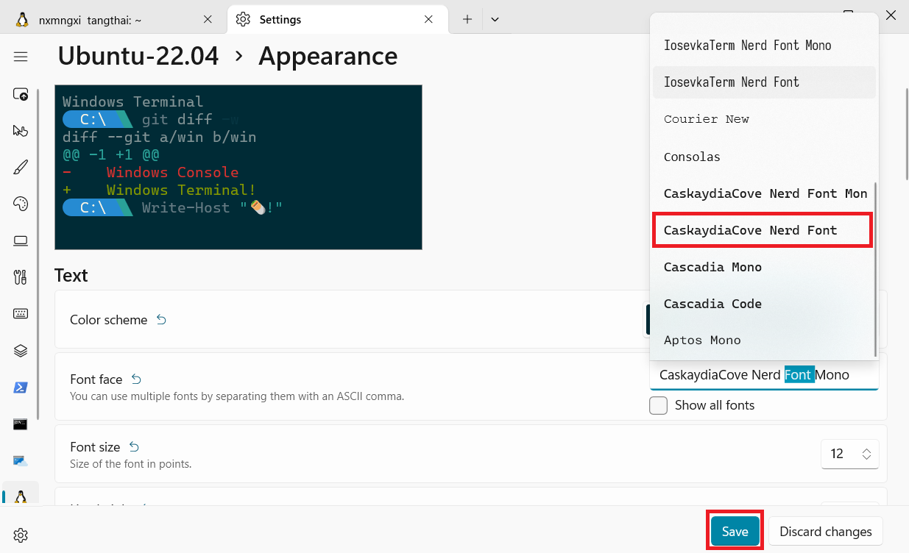

---

## Basic Tools

### 10. Install basic tools

```bash
sudo apt update && sudo apt upgrade -y
sudo apt install -y tar zip unzip git build-essential python3-pip python3-venv pipenv tmux mypy dos2unix xclip emacs-nox vim neovim bat wget curl gnupg ca-certificates kdiff3
```

### 11. Install basic dot files

```bash
git clone --depth 1 https://github.com/kittipitch/ubuntu_home.git /tmp/temp
cd /tmp/temp/
mv .bashrc ~/
mv .bash_profile ~/
mv .dircolors ~/
mv .gitconfig ~/
mv .emacs.d ~/
mv .config ~/
source ~/.bash_profile
source ~/.bashrc
cd
```

### 12. Check Python

```bash
python3 --version
```

### 13. Upgrade pip and other package managers

Upgrade `pip`:

```bash
python3 -m pip install --upgrade pip
```

*(Optional)* Install `pipx` and `uv` (a much faster Python package manager) for future use:

```bash
sudo apt install -y pipx
pipx install uv
```

### 14. Install Base16 color scheme

```bash
git clone https://github.com/tinted-theming/tinted-shell.git "$HOME"/.config/tinted-shell
```

### 15. Test Python

Create `hello.py`:

```python
print("Hello world!!")
```

Run:

```bash
python3 hello.py
```

---

## Sublime Text Configuration

### 16. Installing and Configuring mypy via WSL

Static type checking for Python ensures your code is bug-free before you run it.

#### 16.1 Verify mypy installation

`mypy` was already installed in **Step 10** (Installing basic tools). You can verify it now in your terminal:

```bash
# Bash/WSL
mypy --version
```

If it shows a version (e.g. `mypy 1.8.0`), proceed to the next step. Otherwise, install it now:

```bash
# Bash/WSL
sudo apt update && sudo apt install -y mypy
```

#### 16.2 Install SublimeLinter and SublimeLinter-mypy

1. **Ctrl + Shift + P** → "Package Control: Install Package"


2. Type "SublimeLinter" and hit Enter.


3. **Ctrl + Shift + P** → "Package Control: Install Package"
4. Type "SublimeLinter-mypy" and hit Enter.


#### 16.3 Create the WSL bridge script

SublimeLinter runs as a Windows process and calls the linter with Windows paths (e.g. `C:\project\foo.py` or `D:\project\foo.py`). Since mypy lives in WSL, we need a `.bat` wrapper that converts Windows paths to WSL paths before invoking mypy.

Create a folder for the script (e.g. `C:\bin\` or `D:\bin\`) and save this as `mypy-wsl.bat`:

> **Note:** While placing files in the `C:\` drive is fine (as every PC has it), files here are easily lost if Windows is reinstalled. It is highly recommended to store your code, scripts, and personal files (like Desktop/Documents) on a secondary drive like `D:\` if available.

```bat
@echo off
setlocal enabledelayedexpansion

set "final_args="

:loop
if "%~1"=="" goto :done
set "arg=%~1"
if "!arg:~1,2!"==":\" (
    for /f "delims=" %%P in ('wsl wslpath "!arg!" 2^>nul') do (
        set "final_args=!final_args! "%%P""
    )
) else (
    set "final_args=!final_args! !arg!"
)
shift
goto :loop

:done
wsl mypy %final_args%
endlocal
```

**How it works:** Each argument is inspected — if it looks like a Windows path (`X:\...`), it is converted to a WSL path via `wsl wslpath`. All other arguments (flags like `--ignore-missing-imports`) are passed through unchanged.

#### 16.4 Configure SublimeLinter

Go to **Preferences → Package Settings → SublimeLinter → Settings** and add to the right panel:


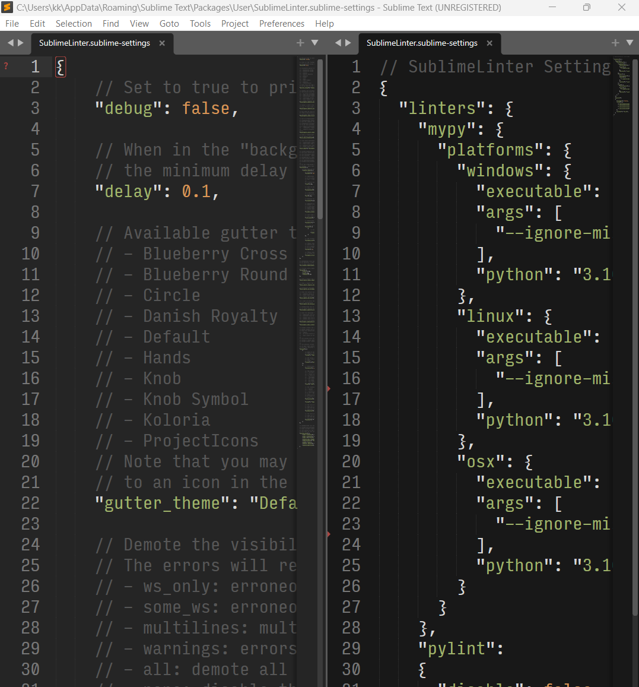

```json
{
  "linters": {
    "mypy": {
      "disable": false,
      "executable": ["C:\\bin\\mypy-wsl.bat"],
      "args": ["--ignore-missing-imports"]
    }
  }
}
```

> **Note:** Adjust the path `C:\\bin\\mypy-wsl.bat` to wherever you saved `mypy-wsl.bat` (e.g. `D:\\bin\\mypy-wsl.bat`). Use double backslashes (`\\`) in JSON.

#### 16.5 Verify it works

To verify that `mypy` is correctly configured and talking to WSL:

1. Create a `test_mypy.py` file in Sublime Text:

   ```python
   #!/usr/bin/env python3

   def hello() -> str:
       return 10
   ```

2. **Save the file.** You should immediately see a red dot or error underline.
3. Hover over the error to see the `mypy` message: **"Incompatible return value type (got 'int', expected 'str')"**, as shown below.

   

4. Change `return 10` to `return "hello"` and save — the error should disappear.

### 17. Installing Terminus on Sublime Text

Terminus provides an integrated terminal within Sublime Text, allowing you to run WSL commands without switching windows.

#### 17.1 Install Package Control

- **Ctrl + Shift + P**
- Type "Install Package Control" and hit Enter

#### 17.2 Add Package Control Channel (if needed)

- **Ctrl + Shift + P**
- Type "Package Control: Add Channel" and hit Enter
- Paste: `https://packages.sublimetext.io/channel.json`
- Hit Enter

#### 17.3 Install Terminus

- **Ctrl + Shift + P**
- Type "Package Control: Install Package" and hit Enter
- Type "Terminus" and hit Enter


#### 17.4 Configure WSL

- Go to **Preferences → Package Settings → Terminus → Settings**


- Edit the right panel and add:

```json
{
    "default_config": {
        "linux": "Bash",
        "osx": "Zsh",
        "windows": "WSL"
    },
    "shell_configs": [
        {
            "name": "WSL",
            "cmd": ["wsl.exe"],
            "cwd": "${project_path:${folder}}",
            "env": {},
            "enable": true,
            "default": false
        }
    ]
}
```

#### 17.5 Set keyboard shortcuts

- Go to **Preferences → Key Bindings**


- Edit the right panel and add:

```json
[
  {
    "keys": ["alt+`"],
    "command": "toggle_terminus_panel",
    "args": {
      "config_name": "WSL",
      "cwd": "${file_path:${folder}}"
    }
  }
]
```

#### 17.6 Restart Sublime Text

Now you can use **Alt + `** to open a bash terminal in Sublime Text.


### 17. Exit Editors (Misc)

If you are stuck in a terminal editor:

- **nano**: Press **Ctrl + X**, then **Y**, then **Enter** to save and exit.
- **emacs**: Press **Ctrl + X**, then **Ctrl + C** to exit.
- **vim**: Press **Esc**, then type `:q!` and press **Enter** to exit without saving.

---

## Haskell Setup

### 19. Haskell Setup via GHCup

We will install GHCup, which manages Haskell compilers and tools.

0. Install dependencies:

   ```bash
   sudo apt install build-essential curl libffi-dev libffi8 libgmp-dev libgmp10 libncurses-dev pkg-config
   ```

1. Open your terminal (WSL for Windows users) and run:

   ```bash
   curl --proto '=https' --tlsv1.2 -sSf https://get-ghcup.haskell.org | sh
   ```

2. During the installation, answer `y` (Yes) to most prompts, except:
   - **Base channel**: select `g` (GHCup maintained)
   - **Pre-releases / Cross channel**: answer `n` (No)
   - **PATH**: select `a` (Append) or `p` (Prepend)

3. Once completed, load the new PATH:

   ```bash
   source ~/.bashrc
   ```

4. Verify the installation:

   ```bash
   ghcup --version
   ghc --version
   ```

5. Install `stack` and `HUnit`:

   ```bash
   ghcup install stack latest
   cabal update
   cabal install --lib HUnit
   ```

### 20. Configure Sublime Text for Haskell

This setup is **mandatory** for CS115 to ensure proper code formatting and error checking.

1. **Install Ormolu** (Haskell code formatter) globally using stack:

   ```bash
   stack install ormolu-0.7.2.0 --resolver lts-22.44
   ```

2. Make Sublime Text use 2 spaces for Haskell indentation:
   - Save a blank file as `test.hs` to trigger the Haskell syntax, then go to **Preferences → Settings - Syntax Specific**.
   - Add the following configuration:

   ```json
   {
      "tab_size": 2,
      "translate_tabs_to_spaces": true
   }
   ```

3. Connect to the Haskell LSP (Language Server Protocol):
   - Press **Ctrl + Shift + P**
   - Select **Package Control: Install Package**
   - Search for and install **LSP**

4. Configure the LSP settings for Haskell:
   - Open command palette again and select **Preferences: LSP Settings**
   - Add the following configuration:

   ```json
   // Settings in here override those in "LSP/LSP.sublime-settings"

   {
     "lsp_format_on_save": true,

     "clients": {
       "haskell-language-server": {
         "enabled": true,
         "command": [
           "wsl",
           "bash",
           "-c",
           "source ~/.ghcup/env && haskell-language-server-wrapper --lsp"
         ],
         "selector": "source.haskell",
         "settings": {
           "haskell.formattingProvider": "ormolu"
         }
       }
     }
   }
   ```

   > **Note:** We use `bash -c "source ~/.ghcup/env && ..."` instead of `bash -lc` because the login shell (`.bash_profile`) does not source `~/.ghcup/env` automatically. Sourcing it explicitly ensures `haskell-language-server-wrapper` is found regardless of how the shell profile is configured.

### 21. Create and Run a Haskell File (Hello World)

1. Create a `Hello.hs` file in Sublime Text:

   ```haskell
   main :: IO ()
   main = putStrLn "Hello Haskell!!"
   ```

2. Run the file in the terminal (WSL):

   ```bash
   runghc Hello.hs
   ```

### 22. Verify Ormolu and LSP

Once you have verified the basic setup, create a `TestSetup.hs` to see the LSP in action.

1. Create a `TestSetup.hs` file in Sublime Text:

   ```haskell
   -- 1. Test LSP formatting (Ormolu):
   --    Try to mess up indentation or remove spaces around '=',
   --    then save the file. It should auto-format on save.
   x = 1 + 2

   -- Intentional type error to test LSP - uncomment
   -- badValue :: Int
   -- badValue = "this is not an int"

   main :: IO ()
   main = putStrLn "LSP is working!"
   ```

2. **Save the file** and check if it auto-formats.
3. **Uncomment** the `badValue` lines and save. You should see a red error underline or dot. Hover over it to see the error message (as shown below).

   

4. Comment it back and save the file — the error should disappear.
5. Run the file in the terminal (WSL):

   ```bash
   runghc TestSetup.hs
   ```

---

## Appendices

### Appendix A: Windows Terminal (Offline Installer)

If you can't use the Microsoft Store, download the offline installer:
<https://github.com/microsoft/terminal/releases>

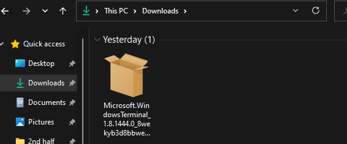

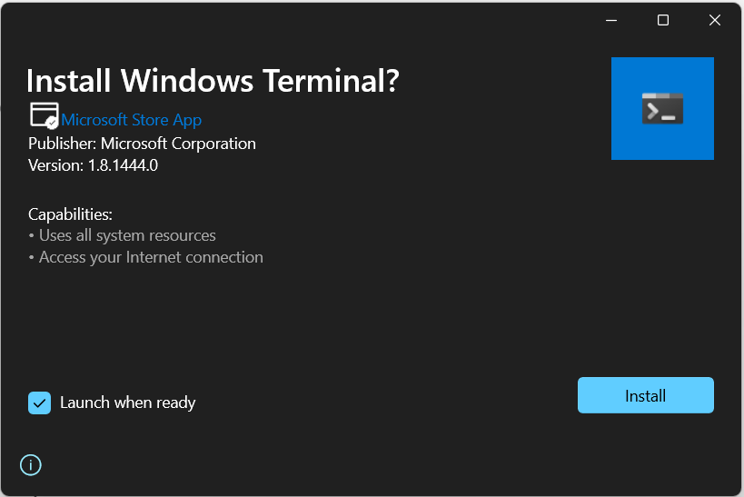

### Appendix B: Adding VSCode to PATH

1. Edit ~/.bash_profile:

   ```bash
   [[ -f ~/.bash_profile ]] || ln -s ~/.profile ~/.bash_profile
   nano ~/.bash_profile
   ```

2. Add to the last line (adjust path as needed):

   ```bash
   export PATH=$PATH:/mnt/c/Users/YOUR_USERNAME/AppData/Local/Programs/Microsoft\ VS\ Code/bin
   ```

   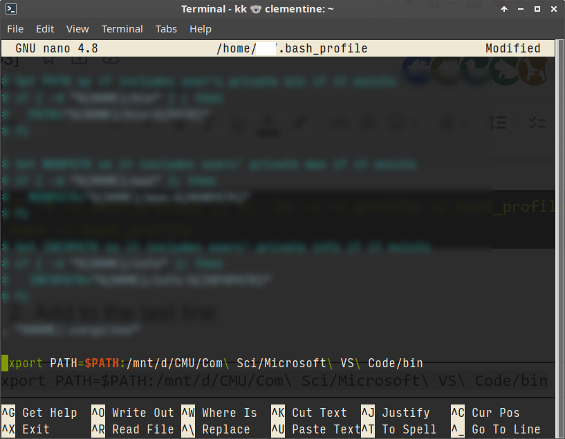

3. Save and exit: **Ctrl + O**, **Enter**, **Ctrl + X**

### Appendix C: Install Code Formatter for Python on VSCode

1. **Install autopep8:**

   ```bash
   sudo apt install -y python3-pip
   sudo pip3 install --upgrade autopep8
   ```

2. **Configure VSCode settings:**

   ```bash
   code ~/.vscode-server/data/Machine/settings.json
   ```

3. **Edit the file and add:**

   ```json
   {
       "python.defaultInterpreterPath": "/usr/bin/python3",
       "python.formatting.provider": "autopep8",
       "[python]": {
           "editor.tabSize": 4,
           "editor.insertSpaces": true,
           "editor.formatOnSave": true
       }
   }
   ```

### Appendix D: Removing WSL Distributions

To remove a WSL distribution:

1. **Open PowerShell with administrator privilege:**
   - Win + R
   - Type "powershell"
   - Ctrl + Shift + Enter
   - Select "Yes" at the pop-up

2. **List all WSL versions:**

   ```powershell
   PS C:\WINDOWS\system32> wsl -l -v
   ```

3. **Uninstall a distribution:**

   ```powershell
   PS C:\WINDOWS\system32> wsl --unregister Ubuntu-24.04
   ```

### Appendix E: Enabling Virtualization Technology

1. Open Task Manager → Performance → Check if Virtualization is enabled

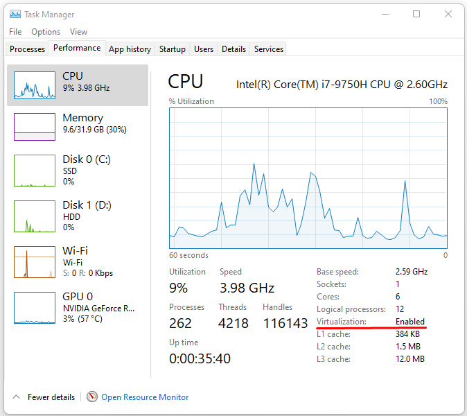

2. If not, restart and access BIOS

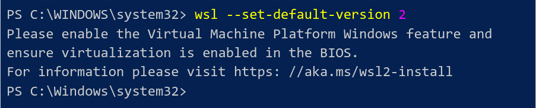

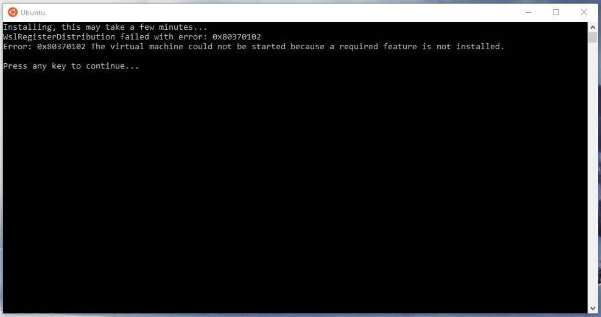
3. Navigate to "System Configuration" → "Virtualization Technology"
4. Set to "Enabled"

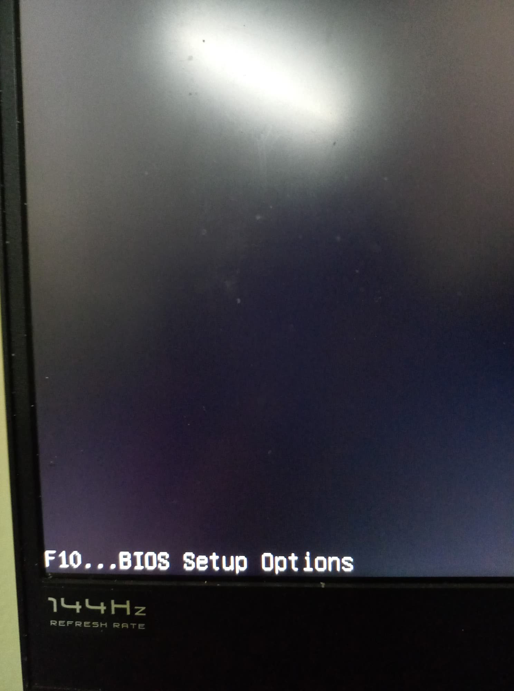

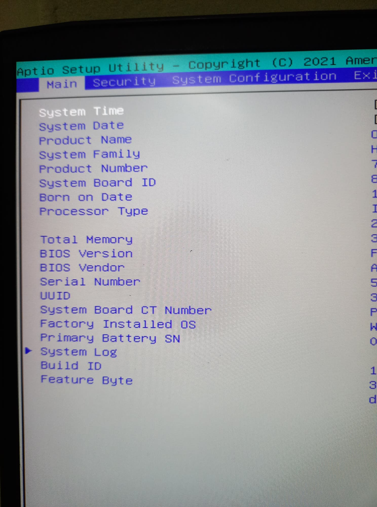
5. Exit saving changes (F10)

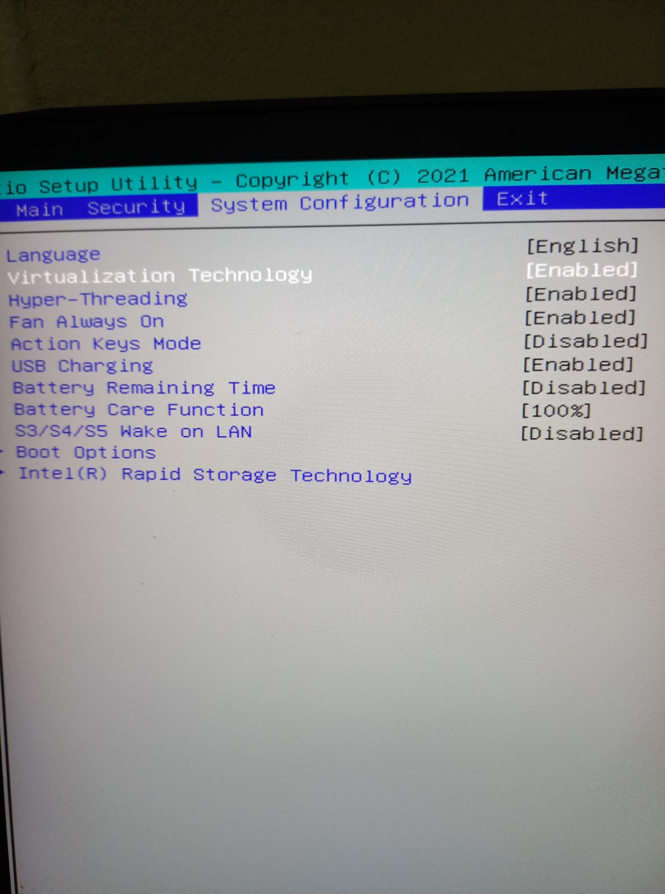

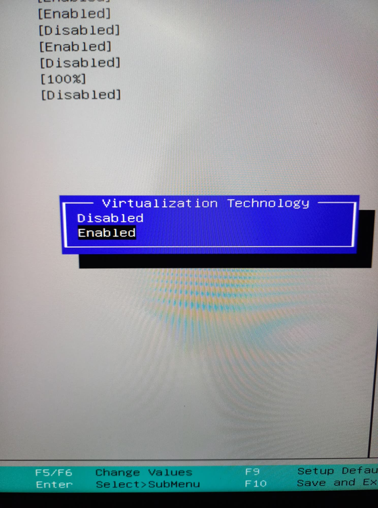

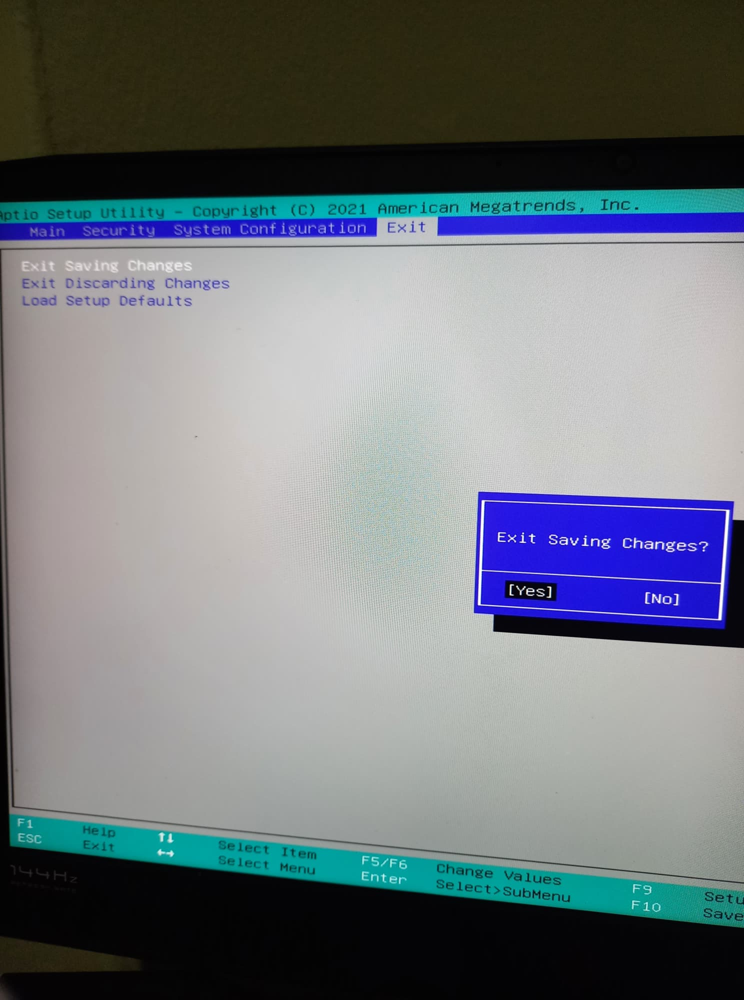

---

*For issues or questions, refer to your course-specific instructions or wiki.*
