# Windows (Native, no WSL) Setup Guide

This guide sets up a full programming environment directly on Windows 10/11 — **no WSL**.
It covers every course: Python, Haskell, Java, C/C++, NodeJS + Bun, Go, and Docker.

> **Note:** If you cannot install local tools, use the **[GitHub Codespaces (CS111 Fundamentals of Programming Template)](https://github.com/codespaces/new?hide_repo_select=true&repo=kittipitch/26cs111codespaces)**.

> **Prefer WSL?** The [Windows + WSL guide](WINDOWS.md) runs the tools inside Ubuntu instead.
> This guide is for students who cannot or do not want to use WSL.

All commands below are typed in **PowerShell** (not as Administrator unless the step says so).

## Table of Contents

- [Before You Start](#before-you-start) (winget, coreutils)
- [Basic Tools](#basic-tools)
- [Python](#python)
- [Sublime Text](#sublime-text)
- [Haskell](#haskell)
- [Java](#java)
- [C/C++](#cc)
- [NodeJS, Bun & Go](#nodejs-bun--go)
- [Docker](#docker)
- [Additional Tools](#additional-tools) (AI CLIs: agy, claude, codex)
- [Troubleshooting](#troubleshooting)

---

## Before You Start

### 1. Change language input hotkey

Change to **Win + Space bar** (or anything else). **DO NOT use 'Grave Accent'** to switch languages —
**Alt + `** is used later to open the terminal inside Sublime Text.

### 2. Allow PowerShell scripts

Windows blocks PowerShell scripts by default. `npm`, `npx`, and the Haskell installer are
PowerShell scripts, so they fail with *"running scripts is disabled on this system"* until you run:

```powershell
Set-ExecutionPolicy -Scope CurrentUser RemoteSigned
```

Answer `Y` if asked.

### 3. winget — the Windows package manager (instead of `apt` / `brew`)

On Windows, **`winget`** does the job of `apt` (Ubuntu) and `brew` (macOS): it installs, upgrades,
and removes programs from the command line. Every install in this guide uses it.

#### 3.1 Check that winget is installed

`winget` is part of **App Installer**, which ships with Windows 11 and Windows 10 (1809 or later):

```powershell
winget --version
```

If you get *"winget is not recognized"*:

1. Ask Windows to register it (common right after a first login):

   ```powershell
   Add-AppxPackage -RegisterByFamilyName -MainPackage Microsoft.DesktopAppInstaller_8wekyb3d8bbwe
   ```

2. Still missing? Install or update **App Installer** from the Microsoft Store:
   <https://apps.microsoft.com/detail/9nblggh4nns1>

Open a new PowerShell window and run `winget --version` again.

#### 3.2 apt / brew → winget cheat sheet

| Task | Ubuntu (`apt`) | macOS (`brew`) | Windows (`winget`) |
|------|----------------|----------------|--------------------|
| Find a package | `apt search fzf` | `brew search fzf` | `winget search fzf` |
| Install | `sudo apt install fzf` | `brew install fzf` | `winget install -e --id junegunn.fzf` |
| Install a specific version | `sudo apt install pkg=1.2` | `brew install pkg@1.2` | `winget install -e --id Pkg.Id --version 1.2` |
| List installed | `apt list --installed` | `brew list` | `winget list` |
| Upgrade everything | `sudo apt upgrade` | `brew upgrade` | `winget upgrade --all` |
| Uninstall | `sudo apt remove fzf` | `brew uninstall fzf` | `winget uninstall -e --id junegunn.fzf` |
| Hold a version | `sudo apt-mark hold pkg` | `brew pin pkg` | `winget pin add --id Pkg.Id --version 1.2.*` |

- Always install by **`--id`** with **`-e`** (exact match), as this guide does — names can match several packages.
- No `sudo`: winget asks for administrator rights (a Windows prompt) only when an installer needs them.
- The first `winget` command asks you to accept the source agreement — answer `Y`.

> [!IMPORTANT]
> **Open a NEW PowerShell window after every `winget install`.** A window that was already open
> does not see the new program on its `PATH`, so the version checks will say "not recognized".

#### 3.3 Linux commands on Windows (coreutils) and a terminal editor

PowerShell has its own commands (`Get-ChildItem`, ...). To get the same `ls`, `cat`, `cp`, `mv`,
`rm`, `head`, `tail`, `wc`, `sort`, ... that you use on Ubuntu and macOS, install **uutils
coreutils** (the GNU coreutils rewritten in Rust, built for Windows). Also install **Microsoft
Edit** (`edit`), a small terminal text editor from Microsoft, like `nano` (newer Windows 11
builds already include it; installing it again is harmless):

```powershell
winget install -e --id uutils.coreutils
winget install -e --id Microsoft.Edit
```

PowerShell already has built-in *aliases* named `ls`, `cat`, `cp`, ... that would hide the real
commands. Remove them in your PowerShell profile (runs every time PowerShell starts). The second
line makes PowerShell pass text to these commands as plain UTF-8 — without it, an invisible
marker is added to the first line and `sort`, `grep`, ... give wrong results:

```powershell
if (!(Test-Path $PROFILE)) { New-Item -ItemType File -Path $PROFILE -Force | Out-Null }
Add-Content $PROFILE @'
foreach ($a in 'cat','cp','echo','ls','mv','pwd','rm','rmdir','sleep','sort','tee') { Remove-Item "Alias:$a" -Force -ErrorAction SilentlyContinue }
$OutputEncoding = [Console]::InputEncoding = [Console]::OutputEncoding = New-Object System.Text.UTF8Encoding $false
'@
```

Open a new PowerShell window and check:

```powershell
ls --version      # Should show: ls (uutils coreutils) ...
ls -la
"b","a" | sort    # Should print a, then b
edit --version
```

> **Note:** after this, `ls`/`rm`/`cp` take Linux-style options (`rm -rf dir`, `ls -la`),
> not PowerShell ones (`-Recurse`, `-Force`). Use the full PowerShell names
> (`Get-ChildItem`, `Remove-Item`) when you need the PowerShell behaviour.

---

## Basic Tools

### 4. Install Windows Terminal

Already installed on Windows 11. On Windows 10:

```powershell
winget install -e --id Microsoft.WindowsTerminal
```

### 5. Install Git

```powershell
winget install -e --id Git.Git
```

Open a new window, then set your identity:

```powershell
git --version
git config --global user.name "Your Name"
git config --global user.email "your.email@example.com"
```

### 6. Install KDiff3

KDiff3 helps you compare files and fix merge conflicts.

```powershell
winget install -e --id KDE.KDiff3
```

winget installs it for your user only, in `%LOCALAPPDATA%\Programs\KDiff3\bin`. Add that folder
to your Path:

```powershell
[Environment]::SetEnvironmentVariable('Path', [Environment]::GetEnvironmentVariable('Path', 'User') + ";$env:LOCALAPPDATA\Programs\KDiff3\bin", 'User')
```

Open a new window and check that it is found: `Get-Command kdiff3`

---

## Python

### 7. Install Python 3.12

**Remove any other Python installations first** (Settings → Apps → search "Python").

```powershell
winget install -e --id Python.Python.3.12 --scope user
```

Open a new window and check:

```powershell
python --version   # Should show Python 3.12.x
```

> If `python` opens the Microsoft Store instead, see [Troubleshooting](#python-opens-the-microsoft-store).

### 8. Install mypy and uv

`mypy` checks Python types. `uv` is a fast Python package manager.

```powershell
python -m pip install mypy
winget install -e --id astral-sh.uv
```

Open a new window and check:

```powershell
mypy --version
uv --version
```

Test Python — create `hello.py`:

```python
print("Hello world!!")
```

Run:

```powershell
python hello.py
```

---

## Sublime Text

### 9. Install Sublime Text 4

```powershell
winget install -e --id SublimeHQ.SublimeText.4
```

Add Sublime Text to the Windows Path so `subl` works in the terminal:

1. Windows Key + R
2. Type "sysdm.cpl" and press Enter
3. Click Advanced → Environment Variables

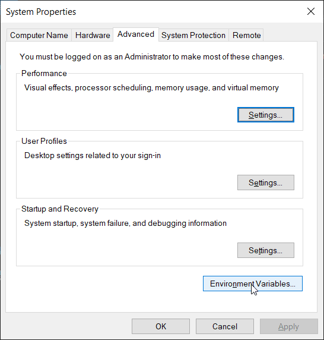

4. Click on "Path" then Edit

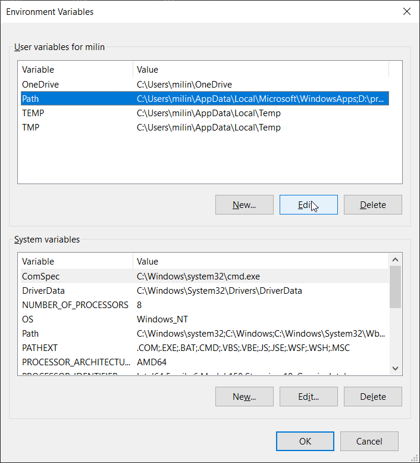

5. Click New

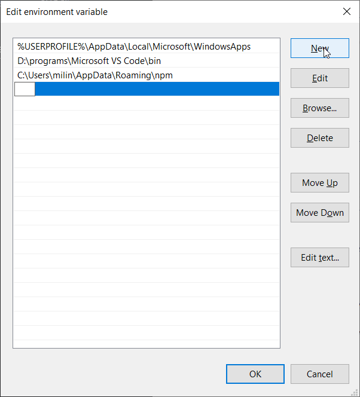

6. Add path: `C:\Program Files\Sublime Text`

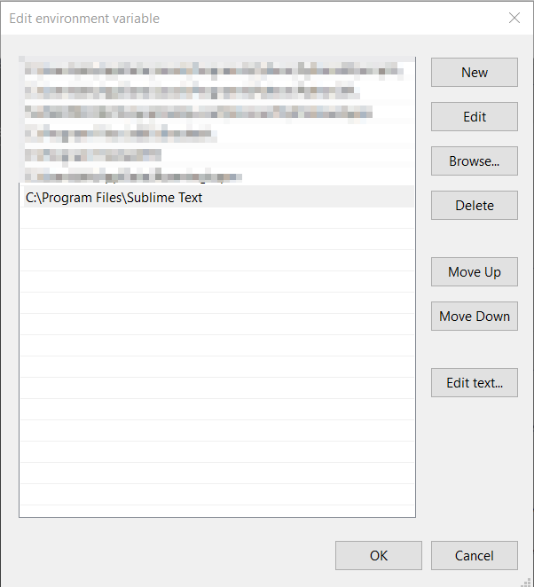

### 10. Configure Sublime Text for Python

Make Sublime Text use 4 spaces for Python:

1. Create a `hello.py` file and save it
2. Go to **Preferences → Settings - Syntax Specific**
3. Add:

   ```json
   {
      "tab_size": 4,
      "translate_tabs_to_spaces": true,
   }
   ```

   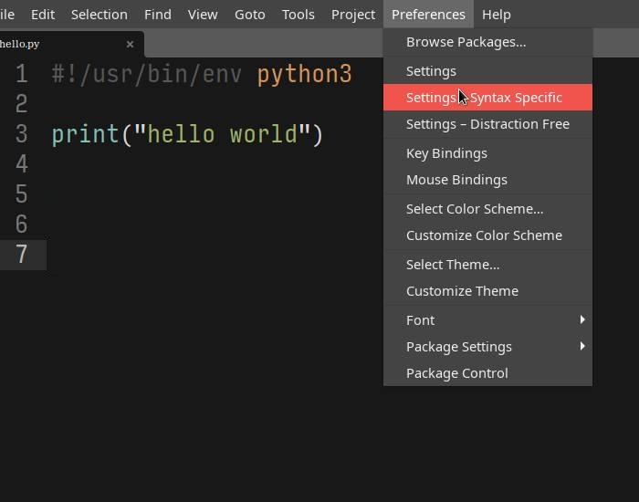

4. Save (Ctrl+S)

### 11. Install Package Control

- **Ctrl + Shift + P**
- Type "Install Package Control" and hit Enter

If packages are missing later, add the channel:

- **Ctrl + Shift + P** → "Package Control: Add Channel"
- Paste: `https://packages.sublimetext.io/channel.json`

### 12. Installing and Configuring mypy on Sublime Text

#### 12.1 Install SublimeLinter and SublimeLinter-mypy

1. **Ctrl + Shift + P** → "Package Control: Install Package"

   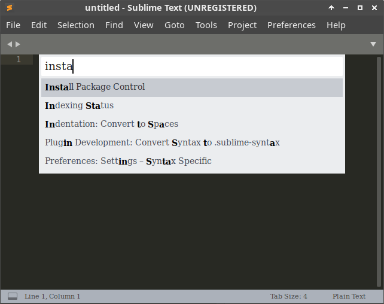

2. Type "SublimeLinter" and hit Enter.

   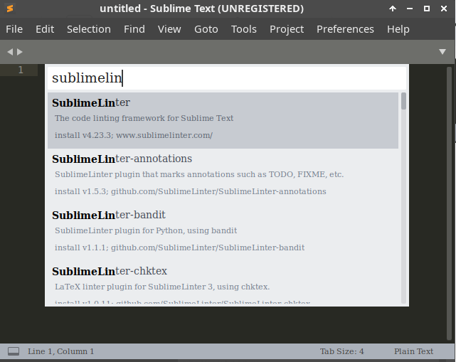

3. **Ctrl + Shift + P** → "Package Control: Install Package"
4. Type "SublimeLinter-mypy" and hit Enter.

   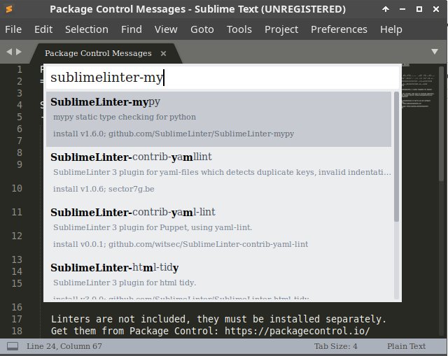

#### 12.2 Configure SublimeLinter

Go to **Preferences → Package Settings → SublimeLinter → Settings** and add to the right panel:

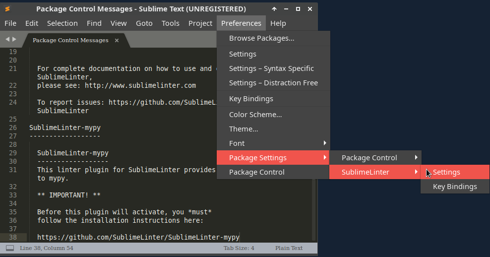

```json
{
  "linters": {
    "mypy": {
      "disable": false,
      "executable": ["mypy"],
      "args": ["--ignore-missing-imports"],
      "python": "3.12"
    }
  }
}
```

No bridge script is needed — `mypy` runs natively.

#### 12.3 Verify it works

1. Create a `test_mypy.py` file:

   ```python
   def hello() -> str:
       return 10
   ```

2. **Save the file.** You should see a red dot or error underline.
3. Hover over it: **"Incompatible return value type (got 'int', expected 'str')"**.

   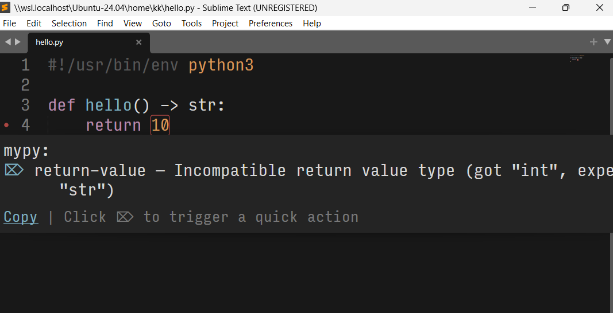

4. Change `return 10` to `return "hello"` and save — the error should disappear.

> No error shown? Restart Sublime Text (it only reads `PATH` when it starts).

### 13. Installing Terminus on Sublime Text

Terminus adds a terminal inside Sublime Text.

#### 13.1 Install Terminus

- **Ctrl + Shift + P** → "Package Control: Install Package" → "Terminus"
- **Ctrl + Shift + P** → "**Package Control: Satisfy Dependencies**"

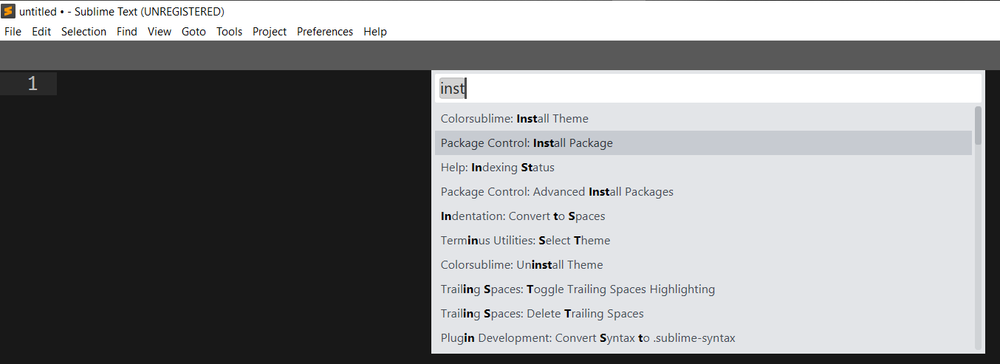

#### 13.2 Configure Terminus

Go to **Preferences → Package Settings → Terminus → Settings** and add to the right panel:

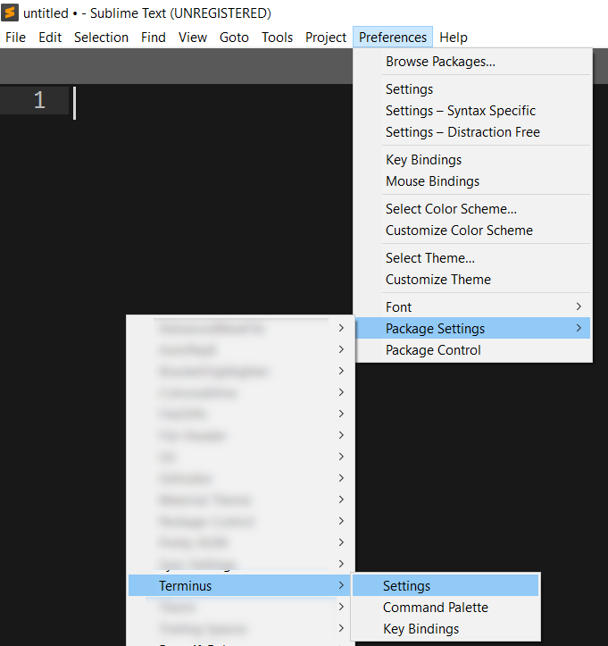

```json
{
    "default_config": {
        "linux": "Bash",
        "osx": "Zsh",
        "windows": "PowerShell"
    }
}
```

#### 13.3 Set keyboard shortcuts

Go to **Preferences → Key Bindings** and add to the right panel:

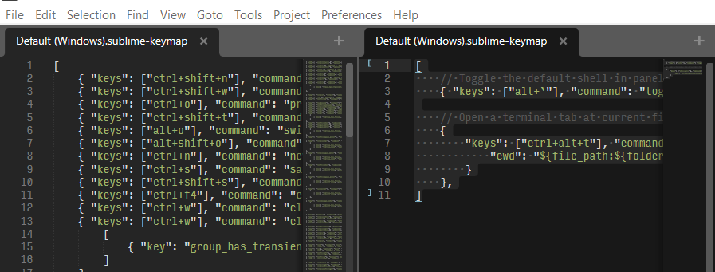

```json
[
  {
    "keys": ["alt+`"],
    "command": "toggle_terminus_panel",
    "args": {
      "config_name": null,
      "cwd": "${file_path:${folder}}"
    }
  }
]
```

Restart Sublime Text. **Alt + `** now opens PowerShell inside Sublime Text.

---

## Haskell

### 14. Haskell Setup via GHCup

GHCup installs and manages Haskell tools. On Windows it also installs MSYS2 (needed to build packages).

1. Open PowerShell (**not** as Administrator) and run:

   ```powershell
   Set-ExecutionPolicy Bypass -Scope Process -Force;[System.Net.ServicePointManager]::SecurityProtocol = [System.Net.ServicePointManager]::SecurityProtocol -bor 3072; try { & ([ScriptBlock]::Create((Invoke-WebRequest https://www.haskell.org/ghcup/sh/bootstrap-haskell.ps1 -UseBasicParsing))) -Interactive -DisableCurl } catch { Write-Error $_ }
   ```

2. Accept the default install location (`C:\ghcup`). Answer **No** to installing HLS and stack
   now — we install the exact course versions in the next step.

3. When it finishes, **close all PowerShell windows** and open a new one. Check:

   ```powershell
   ghcup --version
   ghc --version
   ```

4. Install the course versions (same as the autojudge):

   ```powershell
   ghcup install ghc 9.6.7
   ghcup set ghc 9.6.7
   ghcup install cabal 3.14.2.0
   ghcup set cabal 3.14.2.0
   ghcup install stack 3.7.1
   ghcup set stack 3.7.1
   ghcup install hls 2.13.0.0
   ghcup set hls 2.13.0.0
   cabal update
   cabal install --lib HUnit-1.6.2.0 --force-reinstalls
   ```

### 15. Configure Sublime Text for Haskell

This setup is **mandatory** for CS115.

1. **Install Ormolu** (the Haskell code formatter):

   ```powershell
   cabal install ormolu-0.7.2.0 --overwrite-policy=always
   ```

   Open a new window and check:

   ```powershell
   haskell-language-server-wrapper --version
   ormolu --version
   ```

2. Make Sublime Text use 2 spaces for Haskell: save a blank file as `test.hs`, go to
   **Preferences → Settings - Syntax Specific**, and add:

   ```json
   {
      "tab_size": 2,
      "translate_tabs_to_spaces": true
   }
   ```

3. Install **LSP**: **Ctrl + Shift + P** → "Package Control: Install Package" → "LSP".

4. **Ctrl + Shift + P** → **Preferences: LSP Settings**, and add:

   ```json
   {
     "lsp_format_on_save": true,

     "clients": {
       "haskell-language-server": {
         "enabled": true,
         "command": ["haskell-language-server-wrapper", "--lsp"],
         "selector": "source.haskell",
         "settings": {
           "haskell.formattingProvider": "ormolu"
         }
       }
     }
   }
   ```

5. Restart Sublime Text.

### 16. Create and Run a Haskell File (Hello World)

`Hello.hs`:

```haskell
main :: IO ()
main = putStrLn "Hello Haskell!!"
```

```powershell
runghc Hello.hs
```

### 17. Verify Ormolu and LSP

1. Create `TestSetup.hs`:

   ```haskell
   -- 1. Test LSP formatting (Ormolu):
   --    Try to mess up indentation or remove spaces around '=',
   --    then save the file. It should auto-format on save.
   x = 1 + 2

   -- Intentional type error to test LSP - uncomment
   -- badValue :: Int
   -- badValue = "this is not an int"

   main :: IO ()
   main = putStrLn "LSP is working!"
   ```

2. **Save the file** and check that it auto-formats.
3. Remove the `--` before the `badValue` lines and save. You should see a red error. Hover to read it.

   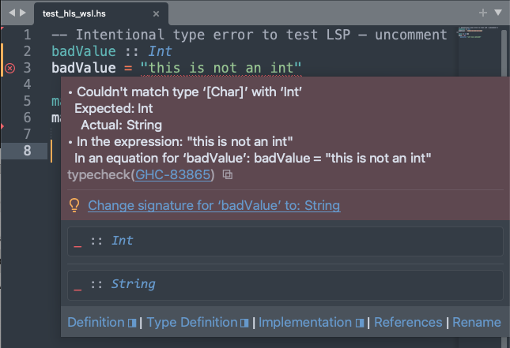

4. Add the `--` back and save. The error should disappear.

---

## Java

### 18. Java Setup

```powershell
winget install -e --id Microsoft.OpenJDK.21
```

Open a new window and check:

```powershell
java -version   # Should show 21.x
```

`Hello.java`:

```java
public class Hello {
    public static void main(String[] args) {
        System.out.println("Hello world!!");
    }
}
```

```powershell
javac Hello.java
java Hello
```

---

## C/C++

### 19. C/C++ Setup (GCC via WinLibs)

WinLibs is GCC (`gcc`, `g++`, `gdb`) built for Windows.

```powershell
winget install -e --id BrechtSanders.WinLibs.POSIX.UCRT
```

Open a new window and check:

```powershell
g++ --version
```

`hello.cpp`:

```cpp
#include <iostream>
using namespace std;

int main() {
    cout << "Hello world!!" << endl;
    return 0;
}
```

```powershell
g++ -o hello.exe hello.cpp
.\hello.exe
```

---

## NodeJS, Bun & Go

### 20. NodeJS 24 Setup

Install **Node.js 24** (comes with `npm` and `npx`), then **pin** it so `winget upgrade` does not
jump to a newer major version:

```powershell
winget install -e --id OpenJS.NodeJS.LTS --version 24.19.0
winget pin add --id OpenJS.NodeJS.LTS --version 24.*
```

Open a new window and check all three:

```powershell
node -v   # Should start with v24.
npm -v
npx -v
```

> `npm -v` fails with "running scripts is disabled"? You skipped [Step 2](#2-allow-powershell-scripts).

### 21. Bun Setup

Bun 1.3.11 (same version as the Ubuntu and macOS guides), pinned:

```powershell
winget install -e --id Oven-sh.Bun --version 1.3.11
winget pin add --id Oven-sh.Bun --version 1.3.11
```

Open a new window and check:

```powershell
bun --version   # Should show 1.3.11
```

### 22. Go Setup

```powershell
winget install -e --id GoLang.Go --version 1.19.13
winget pin add --id GoLang.Go --version 1.19.13
```

Open a new window and check:

```powershell
go version   # Should show go1.19.13
```

`hello.go`:

```go
package main

import "fmt"

func main() {
    fmt.Println("Hello world!")
}
```

```powershell
go run hello.go
```

---

## Docker

### 23. Install Docker Desktop

> [!WARNING]
> Docker on Windows needs a Linux VM. Without WSL, that VM is **Hyper-V**, which exists only on
> **Windows Pro, Education, or Enterprise**. On **Windows Home**, Docker Desktop requires WSL 2 —
> use the [Windows + WSL guide](WINDOWS.md) or a [GitHub Codespace](README.md#browser-based-options) instead.
> Check your edition: Settings → System → About → *Edition*.

1. Turn on Hyper-V — PowerShell **as Administrator**, then reboot:

   ```powershell
   Enable-WindowsOptionalFeature -Online -FeatureName Microsoft-Hyper-V -All
   ```

2. Install Docker Desktop with the Hyper-V backend:

   ```powershell
   winget install -e --id Docker.DockerDesktop --override "install --backend=hyper-v --quiet --accept-license"
   ```

3. Start Docker Desktop. In **Settings → General**, make sure "Use the WSL 2 based engine"
   is **unchecked** (Apply & Restart if you changed it).

4. Let your account use Docker — PowerShell **as Administrator**:

   ```powershell
   net localgroup docker-users $env:USERNAME /add
   ```

   **Sign out and sign back in**, then check (normal PowerShell):

   ```powershell
   docker run --rm hello-world
   ```

### 24. Install lazydocker

lazydocker gives Docker a terminal screen.

```powershell
$v = (Invoke-RestMethod https://api.github.com/repos/jesseduffield/lazydocker/releases/latest).tag_name.TrimStart('v')
Invoke-WebRequest "https://github.com/jesseduffield/lazydocker/releases/download/v$v/lazydocker_${v}_Windows_x86_64.zip" -OutFile "$env:TEMP\lazydocker.zip"
Expand-Archive "$env:TEMP\lazydocker.zip" -DestinationPath "$env:LOCALAPPDATA\lazydocker" -Force
[Environment]::SetEnvironmentVariable('Path', [Environment]::GetEnvironmentVariable('Path', 'User') + ";$env:LOCALAPPDATA\lazydocker", 'User')
```

Open a new window and run `lazydocker`.

---

## Additional Tools

### 25. VSCode, fzf, GitHub CLI

```powershell
winget install -e --id Microsoft.VisualStudioCode
winget install -e --id junegunn.fzf
winget install -e --id GitHub.cli
```

### 26. AI command-line tools: Antigravity (`agy`), Claude Code (`claude`), Codex (`codex`)

```powershell
winget install -e --id Google.AntigravityCLI
winget install -e --id Anthropic.ClaudeCode
winget install -e --id OpenAI.Codex
```

Open a new window and check:

```powershell
agy --version
claude --version
codex --version
```

- Each tool asks you to sign in the first time you run it (`agy`, `claude`, `codex`).
- Claude Code uses **Git Bash** from Git for Windows ([Step 5](#5-install-git)) to run commands.
- winget installs do not auto-update. Update with
  `winget upgrade -e --id Google.AntigravityCLI` (or `Anthropic.ClaudeCode`, `OpenAI.Codex`).

### 27. Verify everything

Open a new PowerShell window and run:

```powershell
git --version; python --version; mypy --version; uv --version
ghc --version; cabal --version; stack --version; ormolu --version
java -version; g++ --version; node -v; npm -v; npx -v; bun --version; go version
docker --version; gh --version; fzf --version
ls --version; edit --version; agy --version; claude --version; codex --version
```

Every line should print a version. A "not recognized" error means that step's install did not
finish, or the window was opened before the install — open a new one and try again.

---

## Troubleshooting

### Python opens the Microsoft Store

Settings → Apps → Advanced app settings → **App execution aliases** → turn **off**
`python.exe` and `python3.exe`. Open a new window.

### A command is "not recognized" right after installing it

Open a **new** PowerShell window. If Sublime Text cannot find a tool (mypy, HLS), restart
Sublime Text — or sign out and back in.

### Exit Editors (Misc)

If you are stuck in a terminal editor:

- **edit** (Microsoft Edit): Press **Ctrl + S** to save, **Ctrl + Q** to exit.
- **nano**: Press **Ctrl + X**, then **Y**, then **Enter** to save and exit.
- **vim**: Press **Esc**, then type `:q!` and press **Enter** to exit without saving.

---

*For issues or questions, refer to your course-specific instructions or wiki.*
